# Xylonic System Architecture

> **Technical Documentation for Developers**  
> A comprehensive guide to understanding Xylonic's internal architecture, data flows, and design patterns.

> **📊 Interactive Diagrams:** This document uses [Mermaid diagrams](https://mermaid.js.org/) which render automatically on GitHub. Click on any diagram to zoom and explore. For local viewing, use a Markdown viewer with Mermaid support (VS Code with Markdown Preview Mermaid Support extension, GitHub Desktop, etc.).

## Table of Contents

1. [Overview](#overview)    
2. [High-Level Architecture](#high-level-architecture)
3. [Multi-Process Architecture](#multi-process-architecture)
4. [IPC Communication Patterns](#ipc-communication-patterns)
5. [Offline Cache System](#offline-cache-system)
6. [Authentication & Security](#authentication--security)
7. [Music Playback Pipeline](#music-playback-pipeline)
8. [Theme Management](#theme-management)
9. [State Management](#state-management)
10. [Design Patterns & Best Practices](#design-patterns--best-practices)
11. [Build Process & Cache Management](#build-process--cache-management)

---

## Overview

Xylonic is an Electron-based desktop music streaming application built with React and TypeScript. It implements a **multi-window architecture** with **bidirectional IPC (Inter-Process Communication)**, **context-based state management**, and a **sophisticated offline caching system** with reference-counted deduplication.

### Core Technologies

| Layer | Technology | Purpose |
|-------|-----------|---------|
| **Desktop Runtime** | Electron 27.3.11 | Native desktop app wrapper |
| **UI Framework** | React 18.2.0 | Component-based user interface |
| **Type Safety** | TypeScript 4.9.5 | Static type checking |
| **State Management** | React Context API | Global state without prop drilling |
| **HTTP Client** | Axios 1.6.0 | API communication with Subsonic servers |
| **Build System** | react-scripts 5.0.1 | Webpack-based bundler |
| **Security** | OS-native keychains | Encrypted credential storage |
| **Packaging** | electron-builder 24.13.3 | Cross-platform app bundler (preset: react-cra) |

### Key Features

- **Multi-window support**: Main window + mini player (separate BrowserWindows)
- **Offline-first architecture**: Local cache with reference counting
- **Real-time synchronization**: Player state synced across windows via IPC
- **Secure by design**: Encrypted credentials, HTTPS enforcement
- **Multi-user support**: Per-user settings, themes, and caches with isolated localStorage keys
- **Cache isolation**: User+server specific cache keys prevent conflicts on shared machines
- **Pagination for large libraries**: 50 artists/albums per page prevents blob URL exhaustion
- **Advanced cache management**: One-click clear all caches (images + offline data) with rebuild
- **Build-time cleanup**: Automatic AppData cleanup before builds (preserves permanent_cache and color_settings)

---

## High-Level Architecture

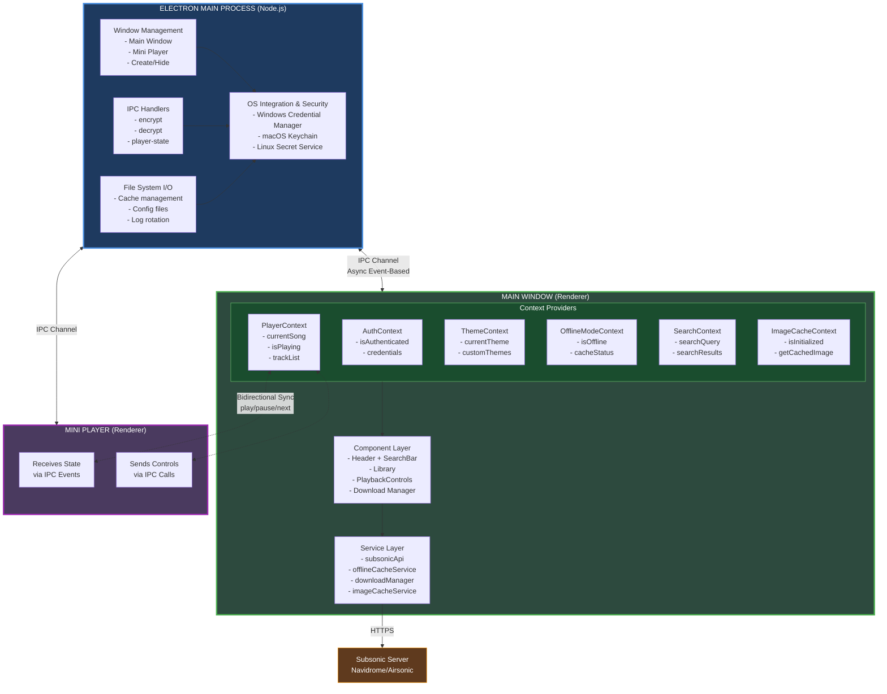

### Architecture Principles

1. **Separation of Concerns**: Main process handles system operations, renderer handles UI
2. **Unidirectional Data Flow**: State flows down, events flow up
3. **Service Layer Abstraction**: Business logic isolated from UI components
4. **Event-Driven Communication**: IPC events enable loose coupling between processes
5. **Defensive Programming**: Extensive null checks, error boundaries, fallback strategies

---

## Multi-Process Architecture

Electron applications run in **two separate processes** that communicate via IPC:

### Main Process (Node.js)

**File:** `public/electron.js`

The main process is a Node.js environment that runs BEFORE any windows are created. It has full access to Node.js APIs and the operating system.

**Responsibilities:**

```javascript
// Main Process Lifecycle
app.whenReady()
  ├─► Create BrowserWindows (main, mini player)
  ├─► Set up IPC handlers (encrypt, decrypt, file I/O)
  ├─► Configure CSP (Content Security Policy)
  └─► Manage app lifecycle (quit, activate)
```

**Key Operations:**

| Operation | Description | Why Main Process? |
|-----------|-------------|-------------------|
| **Window Management** | Create, destroy, show/hide windows | Requires Node.js `BrowserWindow` API |
| **File System I/O** | Read/write cache files, config files | Security: Renderer has limited FS access |
| **OS Keychain Access** | Encrypt/decrypt credentials | Requires native modules (Windows DPAPI, macOS Security Framework) |
| **IPC Event Routing** | Forward events between windows | Only main process can communicate with all renderers |

### Renderer Process (Chromium)

**Files:** `src/` directory (React app)

Each BrowserWindow runs in its own sandboxed renderer process - a Chromium browser environment with limited system access.

**Responsibilities:**

```javascript
// Renderer Process Components
React Application
  ├─► Context Providers (state management)
  ├─► UI Components (visual rendering)
  ├─► Event Handlers (user interactions)
  └─► IPC Communication (via preload bridge)
```

**Security Model:**

| Feature | Enabled | Reason |
|---------|---------|--------|
| **Node Integration** | ❌ Disabled | Prevents direct Node.js API access from web code |
| **Context Isolation** | ✅ Enabled | Isolates renderer code from preload scripts |
| **Sandbox** | ✅ Enabled | Limits system resource access |
| **CSP** | ✅ Strict | Restricts loading external scripts/resources |

**IPC Bridge (Preload Script):**

```javascript
// public/preload.js - Secure IPC bridge
contextBridge.exposeInMainWorld('electron', {
  // Renderer → Main
  send: (channel, data) => ipcRenderer.send(channel, data),
  
  // Main → Renderer (event listener)
  on: (channel, callback) => ipcRenderer.on(channel, callback),
  
  // Request-response pattern
  invoke: (channel, data) => ipcRenderer.invoke(channel, data)
});
```

---

## IPC Communication Patterns

### Pattern 1: Fire-and-Forget (One-Way)

Used when the sender doesn't need a response.

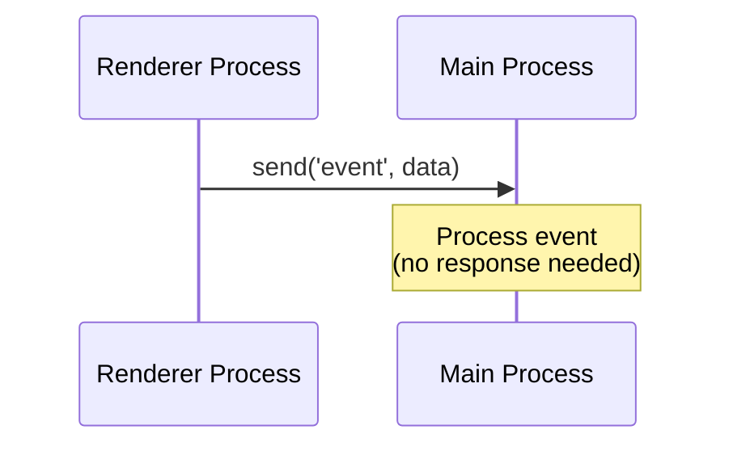

**Example: Send player state to mini player**

```typescript
// PlayerContext.tsx (Main Window)
const sendPlayerState = (state: PlayerState) => {
  if (window.electron?.send) {
    window.electron.send('send-player-state', state);
  }
};

// electron.js (Main Process)
ipcMain.on('send-player-state', (event, state) => {
  lastPlayerState = state; // Cache for new windows
  
  if (miniPlayerWindow && !miniPlayerWindow.isDestroyed()) {
    miniPlayerWindow.webContents.send('player-state-changed', state);
  }
});
```

### Pattern 2: Request-Response (Two-Way)

Used when the sender needs data back from the receiver.

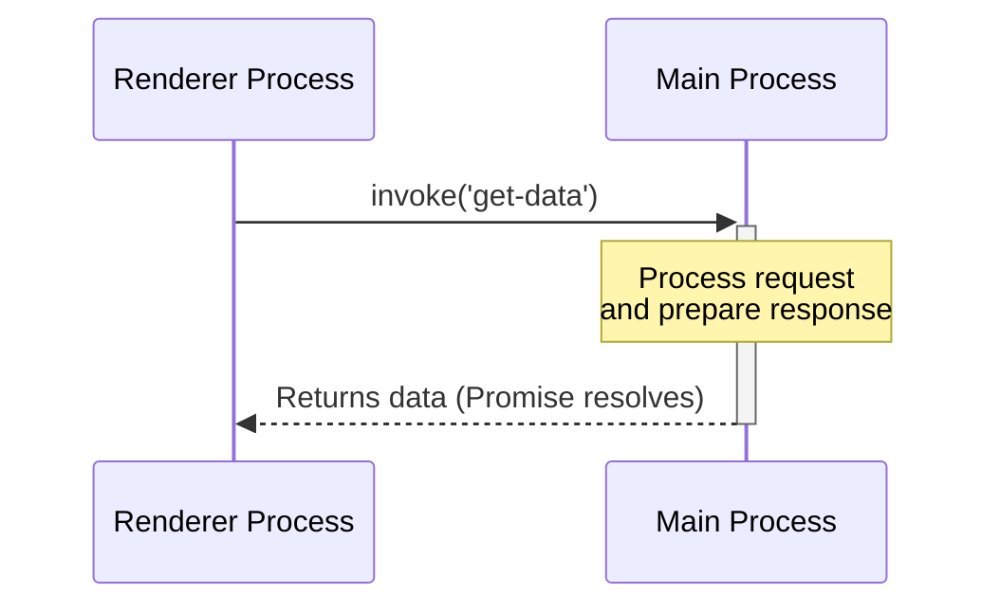

**Example: Encrypt credentials**

```typescript
// secureCredentialService.ts (Renderer)
export const storeCredentials = async (
  serverUrl: string,
  username: string,
  password: string
) => {
  try {
    // Request encryption from main process
    const encrypted = await window.electron.invoke('encrypt-credential', {
      serverUrl,
      username,
      password
    });
    
    // Store encrypted result
    localStorage.setItem('credentials_encrypted', JSON.stringify(encrypted));
  } catch (error) {
    console.error('Encryption failed:', error);
  }
};

// electron.js (Main Process)
ipcMain.handle('encrypt-credential', async (event, data) => {
  try {
    // Use OS-native keychain (Windows DPAPI, macOS Keychain)
    const encrypted = await keytar.setPassword(
      'xylonic',
      `${data.serverUrl}::${data.username}`,
      data.password
    );
    return { success: true, encrypted };
  } catch (error) {
    return { success: false, error: error.message };
  }
});
```

### Pattern 3: Event Broadcasting (One-to-Many)

Used to notify multiple windows of state changes.

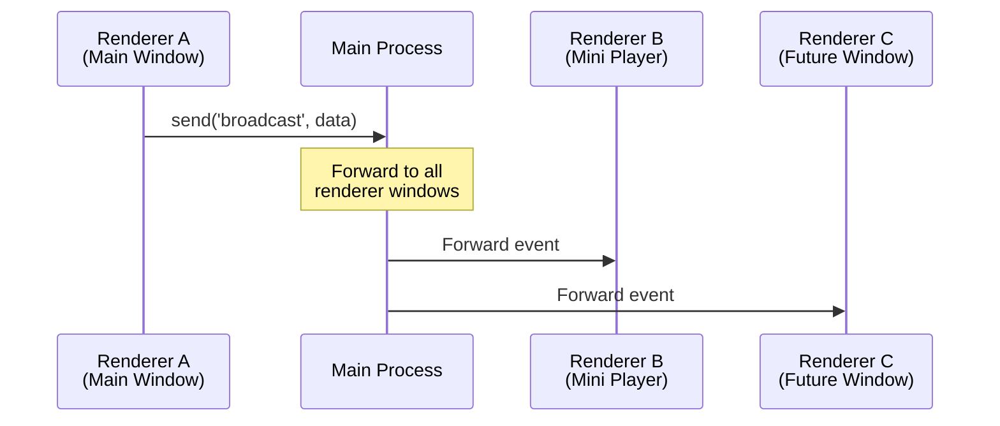

### Mini Player Synchronization Flow

**Opening Mini Player:**

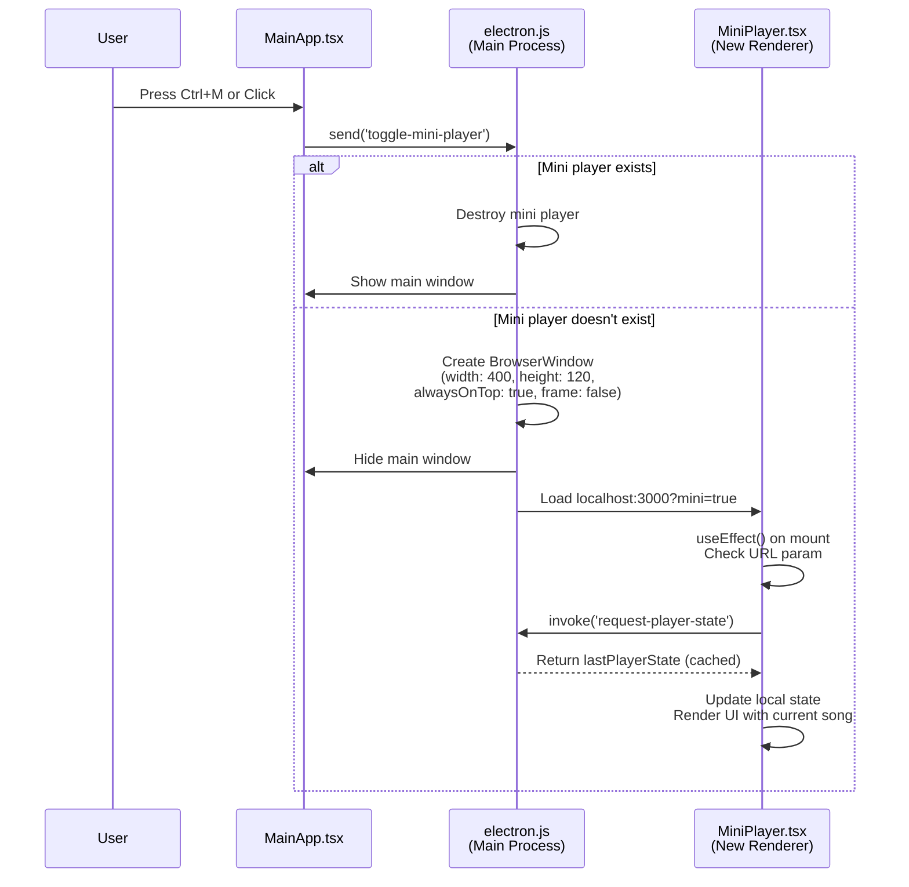

**Real-Time State Synchronization:**

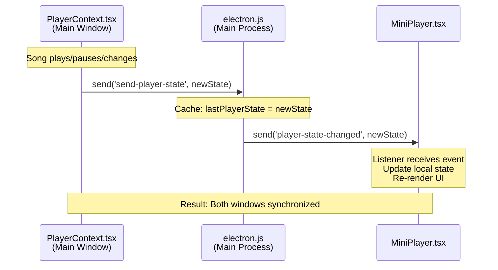

**User Controls from Mini Player:**

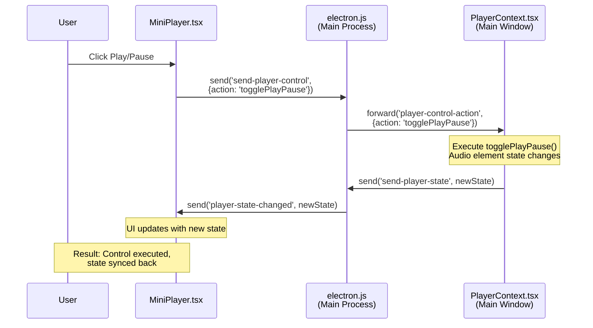

---

## Offline Cache System

### Cache Architecture v2.0

Xylonic implements a **multi-user, reference-counted cache** to prevent audio file duplication while supporting multiple users on the same machine.

### File System Structure

```
%APPDATA%\xylonic\permanent_cache\
│
├── registry.json                    ← Global reference counter
│   {
│     "a3f5e8b9": {
│       "refCount": 2,              ← 2 users have this file
│       "filename": "song1.mp3",
│       "size": 5242880,
│       "hash": "a3f5e8b9"
│     }
│   }
│
├── users\                           ← Per-user metadata
│   ├── user1@server1\
│   │   ├── cache_index.json        ← User 1's cached songs
│   │   │   {
│   │   │     "songs": {
│   │   │       "song-id-123": {
│   │   │         "id": "123",
│   │   │         "title": "Song Name",
│   │   │         "artist": "Artist Name",
│   │   │         "album": "Album Name",
│   │   │         "audioPath": "audio/a3f5e8b9/song1.mp3",
│   │   │         "audioHash": "a3f5e8b9",
│   │   │         "coverArtPath": "covers/c5d7e8b3.jpg",
│   │   │         "coverArtAlias": "album-id-456",
│   │   │         "quality": "320",
│   │   │         "size": 5242880
│   │   │       }
│   │   │     },
│   │   │     "coverArtAliases": {
│   │   │       "album-id-456": "covers/c5d7e8b3.jpg"
│   │   │     }
│   │   │   }
│   │   │
│   │   └── metadata.json           ← User 1's cache stats
│   │       {
│   │         "totalSongs": 145,
│   │         "totalSize": 756023296,
│   │         "lastUpdated": "2026-02-15T10:30:00Z"
│   │       }
│   │
│   └── user2@server2\               ← User 2's isolated cache
│       ├── cache_index.json
│       └── metadata.json
│
├── audio\                           ← Shared audio storage (deduplicated)
│   ├── a3f5e8b9\
│   │   └── song1.mp3               ← Stored once, referenced by multiple users
│   ├── b4c6d7a2\
│   │   └── song2.mp3
│   └── c5d7e8b3\
│       └── song3.mp3
│
└── covers\                          ← Album artwork (aliased)
    ├── c5d7e8b3.jpg                ← One image for entire album
    ├── d6e8f9c4.jpg
    └── e7f9g0d5.jpg
```

### Reference Counting Algorithm

**Adding a Song (User downloads):**

```typescript
// offlineCacheService.v2.ts
async function addSongToCache(song: Song, audioBlob: Blob, quality: string) {
  // 1. Calculate hash of audio data
  const audioHash = await calculateHash(audioBlob);
  
  // 2. Check if file already exists in shared storage
  const audioPath = `audio/${audioHash}/${song.id}.mp3`;
  const fileExists = await checkFileExists(audioPath);
  
  if (!fileExists) {
    // 3a. New file: Store in shared audio folder
    await saveAudioFile(audioPath, audioBlob);
    
    // 3b. Initialize registry entry
    registry[audioHash] = {
      refCount: 1,
      filename: `${song.id}.mp3`,
      size: audioBlob.size,
      hash: audioHash
    };
  } else {
    // 4. File exists: Increment reference count
    registry[audioHash].refCount += 1;
  }
  
  // 5. Add to user's cache_index.json
  userCache.songs[song.id] = {
    ...song,
    audioPath,
    audioHash,
    quality,
    size: audioBlob.size
  };
  
  // 6. Save updates
  await saveRegistry(registry);
  await saveUserCacheIndex(userCache);
}
```

**Deleting a Song (User removes from cache):**

```typescript
async function removeSongFromCache(songId: string) {
  // 1. Get song metadata from user's cache
  const song = userCache.songs[songId];
  if (!song) return;
  
  // 2. Remove from user's cache_index.json
  delete userCache.songs[songId];
  await saveUserCacheIndex(userCache);
  
  // 3. Decrement reference count in registry
  const audioHash = song.audioHash;
  registry[audioHash].refCount -= 1;
  
  // 4. If no one references this file anymore, delete it
  if (registry[audioHash].refCount === 0) {
    await deleteAudioFile(song.audioPath);
    delete registry[audioHash];
    console.log(`Deleted unused file: ${song.audioPath}`);
  }
  
  // 5. Save updated registry
  await saveRegistry(registry);
}
```

### Cover Art Aliasing

To save space, all songs in an album reference the **same cover art file**.

```typescript
// Cover art aliasing system
coverArtAliases: {
  "album-id-456": "covers/c5d7e8b3.jpg"  // One image for entire album
}

// Song references album ID, not direct path
songs: {
  "song-1": {
    "coverArtAlias": "album-id-456",  // References alias
    "coverArtPath": "covers/c5d7e8b3.jpg"
  },
  "song-2": {
    "coverArtAlias": "album-id-456",  // Same album = same image
    "coverArtPath": "covers/c5d7e8b3.jpg"
  }
}
```

**Benefits:**
- 12-song album = 1 cover art file (not 12 copies)
- Reduces cache size by ~95% for album art
- Faster cache operations (fewer files to manage)

### Cache Preload Dialog System

Xylonic implements a **user+server specific cache preload system** that prompts users to populate their cache on first login, using isolated localStorage keys to prevent cache conflicts between different users and servers.

#### User+Server Specific Keys

Each user/server combination maintains its own cache state flags in localStorage:

```typescript
// Helper function generates unique cache keys
const getCacheKey = (key: string): string => {
  const user = username;           // e.g., "john"
  const server = serverUrl;        // e.g., "https://music.example.com"
  
  // Create hash from server URL to keep key shorter
  const serverHash = server.split('').reduce(
    (acc, char) => ((acc << 5) - acc) + char.charCodeAt(0), 
    0
  );
  
  return `${key}_${user}_${Math.abs(serverHash)}`;
  // Result: "cachePreloaded_john_123456789"
};

// Cache state storage
localStorage.setItem(getCacheKey('cachePreloaded'), 'true');
localStorage.setItem(getCacheKey('cachePreloadTimestamp'), Date.now().toString());
```

#### Multi-User Isolation

**Example Scenario:**

| User | Server | Cache Key | Behavior |
|------|--------|-----------|----------|
| **User A** | `https://server1.com` | `cachePreloaded_userA_12345` | First login → Dialog shows |
| **User A** | `https://server1.com` | `cachePreloaded_userA_12345` | Re-login → Dialog skipped (key exists) |
| **User B** | `https://server2.com` | `cachePreloaded_userB_67890` | First login → Dialog shows (different key) |
| **User A** | `https://server2.com` | `cachePreloaded_userA_67890` | Different server → Dialog shows (new key) |

**Key Benefits:**

- **No Cache Conflicts**: Each user/server maintains independent state
- **Preserved Preferences**: Logout doesn't clear other users' cache flags
- **Multi-Server Support**: Same user on different servers gets prompted separately
- **Shared Hardware**: Multiple users on same machine don't interfere

#### Preload Dialog Flow

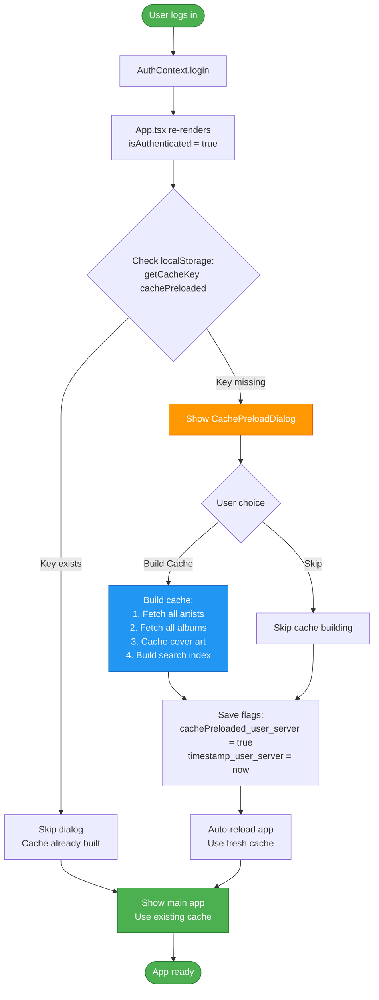

#### Cache Age Checking

The system automatically checks cache age on each login and prompts for refresh if stale:

```typescript
// Check cache age (6-day threshold)
const timestampKey = getCacheKey('cachePreloadTimestamp');
const cacheTimestamp = localStorage.getItem(timestampKey);

if (cacheTimestamp) {
  const age = Date.now() - parseInt(cacheTimestamp);
  const SIX_DAYS = 6 * 24 * 60 * 60 * 1000; // 518,400,000 ms
  
  if (age > SIX_DAYS) {
    console.log(`Cache for ${username}@${serverUrl} is stale - triggering refresh`);
    setShowCachePreload(true); // Auto-prompt for rebuild
  }
}
```

**Auto-Refresh Behavior:**

- Cache older than 6 days triggers automatic refresh prompt
- Each user/server combination tracked independently
- Ensures users always have recent album art and search index
- Prevents stale data from accumulating

#### Robust Caching Strategy for Large Libraries

Xylonic's cache preload system is designed to handle **large music libraries** (1000+ albums, 5000+ songs) reliably without overwhelming browsers or servers.

**Browser Connection Limits:**

Browsers limit concurrent HTTP connections per domain (typically 6-8). To respect this:

```typescript
const SAFE_BATCH_SIZE = 6;        // Respects browser connection pool
const RETRY_ATTEMPTS = 3;          // Retry failed requests up to 3 times
const BATCH_DELAY_MS = 100;        // 100ms delay between batches
```

**Retry Logic with Exponential Backoff:**

```typescript
const fetchWithRetry = async (fn: () => Promise<any>, retries = 3): Promise<any> => {
  for (let attempt = 1; attempt <= retries; attempt++) {
    try {
      return await fn();
    } catch (error) {
      if (attempt === retries) throw error;
      
      // Exponential backoff: 500ms → 1s → 2s
      const delay = Math.min(500 * Math.pow(2, attempt - 1), 2000);
      await new Promise(resolve => setTimeout(resolve, delay));
    }
  }
};
```

**Graceful Failure Handling:**

The system uses `Promise.allSettled` instead of `Promise.all` to prevent cascading failures:

```typescript
// ❌ BAD: Promise.all - One failure kills entire batch
await Promise.all(batch.map(item => fetchItem(item)));

// ✅ GOOD: Promise.allSettled - Individual failures logged, batch continues
const results = await Promise.allSettled(batch.map(item => fetchItem(item)));

results.forEach((result, idx) => {
  if (result.status === 'fulfilled') {
    successCount++;
  } else {
    failCount++;
    console.warn(`Failed item ${batch[idx].name}:`, result.reason);
  }
});
```

**Request Timeouts:**

Each fetch includes a 10-second timeout to prevent hanging:

```typescript
const controller = new AbortController();
const timeoutId = setTimeout(() => controller.abort(), 10000);

const response = await fetch(url, { signal: controller.signal });
clearTimeout(timeoutId);
```

**Performance Characteristics (1183 albums, 315 artists):**

| Phase | Items | Batch Size | Est. Time | Memory | Blob URLs Created |
|-------|-------|------------|-----------|--------|-------------------|
| **Artist Images** | 315 | 6 per batch | ~8-12 min | ~50MB | 0 (IndexedDB only) |
| **Album Images** | 1183 | 6 per batch | ~30-40 min | ~150MB | 0 (IndexedDB only) |
| **Search Index** | 5059 songs | 6 albums/batch | ~15-20 min | ~80MB | N/A |
| **Runtime Display** | Max 50 per page | On-demand | Instant | ~2.5MB | Max 100 (LRU cache) |

**Why This Works for Large Libraries:**

1. **No Memory Spikes**: 6-item batches prevent browser RAM exhaustion during preload
2. **Server-Friendly**: 100ms delays prevent overwhelming Subsonic servers
3. **Fault-Tolerant**: Individual failures don't stop the entire process
4. **Progress Tracking**: Real-time UI updates show success/fail counts
5. **Auto-Recovery**: 3-retry strategy handles transient network issues
6. **No Blob URL Exhaustion**: Images cached to IndexedDB without creating 1500+ blob URLs during preload
7. **Pagination**: UI displays 50 items per page, preventing bulk blob URL creation
8. **On-Demand Creation**: Blob URLs created only when images are actually displayed

**Logging Output Example:**

```
[BATCH 1/198] 1.2s | Success: 6, Failed: 0
[BATCH 2/198] 1.1s | Success: 12, Failed: 0
[BATCH 3/198] 1.5s | Success: 17, Failed: 1  ⚠️ Retry succeeded
...
✅ Album covers: 1172 cached, 11 failed (42min 15s total)
```

#### Blob URL Memory Management

**Problem:** Creating blob URLs for 1500+ images exhausts browser memory, causing `ERR_FILE_NOT_FOUND` errors.

**Solution:** Two-tier caching strategy with pagination:

**Phase 1-3: Bulk IndexedDB Caching (No Blob URLs)**

```typescript
// Cache to IndexedDB only during preload (no blob URLs created)
await imageCacheService.cacheImageDirect(coverArtId, url, blob, true); // skipMemoryCache = true
```

**UI Pagination (Prevents Bulk Blob URL Creation)**

```typescript
// ArtistList.tsx & AlbumList.tsx - Display 50 items per page
const artistsPerPage = 50;
const startIndex = (currentPage - 1) * artistsPerPage;
const endIndex = startIndex + artistsPerPage;
const paginatedArtists = filteredArtists.slice(startIndex, endIndex);

// Only 50 images rendered at once, preventing memory exhaustion
return paginatedArtists.map(artist => (
  <ArtistCard key={artist.id} coverArtId={artist.coverArtId} />
));
```

**Runtime: On-Demand Blob URL Creation**

```typescript
async getImage(coverArtId, serverFetchFn) {
  // 1. Check memory cache (max 100 blob URLs)
  if (memoryCache.has(coverArtId)) return memoryCache.get(coverArtId);
  
  // 2. Retrieve from IndexedDB and create blob URL on-demand
  const cached = await getCachedImage(coverArtId);
  if (cached) {
    const blobUrl = URL.createObjectURL(cached.blob); // Created only when needed
    addToMemoryCache(coverArtId, blobUrl); // LRU cache with max 100 items
    return blobUrl;
  }
  
  // 3. Fetch from server as fallback
  return serverFetchFn();
}
```

**Memory Cache Logic (LRU Eviction):**

```typescript
private addToMemoryCache(coverArtId: string, blobUrl: string): void {
  // If cache is full, remove oldest entry
  if (this.memoryCache.size >= 100) {
    const firstKey = this.memoryCache.keys().next().value;
    const oldBlobUrl = this.memoryCache.get(firstKey);
    URL.revokeObjectURL(oldBlobUrl); // Prevent memory leak
    this.memoryCache.delete(firstKey);
  }
  
  this.memoryCache.set(coverArtId, blobUrl);
}

clearMemoryCache(): void {
  // Revoke all blob URLs (called after each warming chunk)
  this.memoryCache.forEach((blobUrl) => {
    URL.revokeObjectURL(blobUrl);
  });
  this.memoryCache.clear();
}
```

**Benefits:**

- **No Bulk Blob URLs**: Preload stores 1500+ images in IndexedDB without creating blob URLs
- **Pagination**: UI displays 50 artists/albums per page, preventing bulk rendering
- **Memory Efficient**: Max 100 blob URLs in memory at any time via LRU cache
- **On-Demand Creation**: Blob URLs created only when images are actually displayed on screen
- **Automatic Cleanup**: LRU eviction + `URL.revokeObjectURL()` prevents memory leaks
- **Fast Rendering**: 100-item memory cache provides instant access to recently viewed images
- **Persistent Storage**: IndexedDB retains images across sessions without blob URL overhead
- **Scalable**: Works with libraries of 1000+ albums without memory issues

**Memory Profile:**

| Phase | Blob URLs Active | RAM Usage | Duration |
|-------|------------------|-----------|----------|
| **Phase 1-3: Bulk Cache** | 0 | ~200MB (IndexedDB writes) | 40-60 min |
| **Page 1 Display (50 artists)** | 50 | ~2.5MB | Instant |
| **Page 2 Display (50 albums)** | 100 (50 new + 50 cached) | ~5MB | Instant |
| **Page 3+ Display** | Max 100 (LRU eviction) | ~5MB | Instant |
| **Runtime (ongoing)** | Max 100 (LRU) | ~5MB | Indefinite |


### Cache Lookup Flow

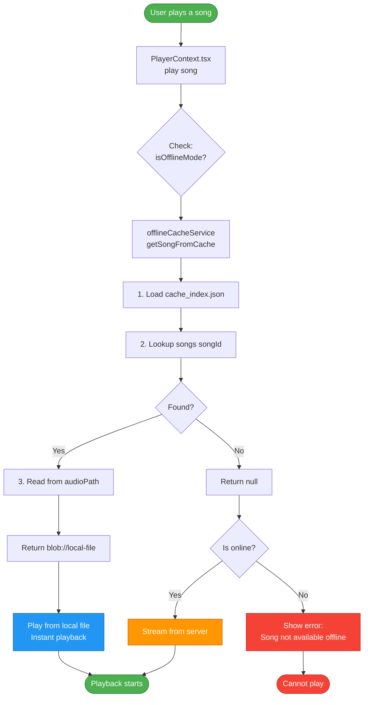

### IndexedDB Image Cache (Multi-User)

In addition to the audio file cache, Xylonic implements a separate **IndexedDB-based image cache** for album artwork, optimized for multi-user environments.

#### Storage Architecture

```
IndexedDB: XylonicImageCache
│
└── Object Store: images
    ├── Composite Key: [userId, coverArtId]
    │   └── Ensures user isolation without data duplication
    │
    └── Indexes:
        ├── userId (query all images for a user)
        ├── timestamp (find expired images)
        └── coverArtId (lookup across users)
```

#### Data Structure

```typescript
interface CachedImage {
  userId: string;           // "username@serverUrl" (generated hash)
  coverArtId: string;       // Album/artist art ID from server
  url: string;              // Original server URL
  blob: Blob;               // Image binary data
  timestamp: number;        // Cache time (for 7-day expiry)
}

// Storage key: [userId, coverArtId]
// Example entries in same database:
["userA_hash", "ar-123"]  → User A's artist image
["userB_hash", "ar-123"]  → User B's same artist (different server/account)
["userA_hash", "al-456"]  → User A's album image
```

#### Multi-User Behavior

**User A logs in (first time):**
```
1. Initialize imageCacheService with userId="userA_hash"
2. Database opened (or created if first launch)
3. Load images: Query IndexedDB for [userA_hash, *]
4. Cache miss → Fetch from server → Store with [userA_hash, coverArtId]
5. Memory cache (blob URLs) created for fast access
```

**User A logs out:**
```
1. State set to uninitialized
2. Memory cache NOT cleared (for performance on re-login)
3. IndexedDB data preserved
4. Database connection stays open
```

**User B logs in:**
```
1. Initialize imageCacheService with userId="userB_hash"
2. Database already open → Switch context only
3. Memory cache from User A cleared (free RAM)
4. Load images: Query IndexedDB for [userB_hash, *]
5. User A's cache data: Still in IndexedDB, untouched
6. Cache miss for User B → Fetch and store with [userB_hash, coverArtId]
```

**User A logs back in:**
```
1. Initialize imageCacheService with userId="userA_hash"
2. Memory cache cleared (User B's blob URLs)
3. Load images: Query IndexedDB for [userA_hash, *]
4. Cache HIT → Instant load from IndexedDB (no server request)
5. Both User A and User B data coexist in same database
```

#### Key Implementation Details

```typescript
// imageCacheService.ts - User switching logic
async initialize(username: string, serverUrl: string): Promise<void> {
  const newUserId = generateUserId(username, serverUrl);
  
  // Already initialized for this user?
  if (this.db && this.userId === newUserId) {
    return; // No-op, continue using existing cache
  }
  
  // Switching users?
  if (this.db && this.userId && this.userId !== newUserId) {
    // Clear memory cache (blob URLs in RAM) only
    this.memoryCache.forEach(blobUrl => URL.revokeObjectURL(blobUrl));
    this.memoryCache.clear();
    
    // Update context, keep database open
    this.userId = newUserId;
    return; // Switch complete, IndexedDB data preserved
  }
  
  // First initialization: Open database
  this.userId = newUserId;
  this.db = await openIndexedDB();
}

// Composite key ensures isolation
const cachedImage = {
  userId: this.userId,      // Current user context
  coverArtId: 'ar-123',     // Album art ID
  blob: imageBlob,
  timestamp: Date.now()
};

// Store with composite key [userId, coverArtId]
await store.put(cachedImage);
```

#### Benefits

- **Zero Purging**: All users' cache data coexists forever
- **Instant Switching**: Context switch is fast (no re-download)
- **Storage Efficient**: Same image from same server shared if multiple users
- **Privacy**: Each user's data isolated by composite key
- **Performance**: 10-20ms cache hits vs 200-500ms server fetches
- **Offline Support**: Works without network once cached

---

## Authentication & Security

### Authentication Flow Diagram

**Scenario 1: Online Login (First Time)**

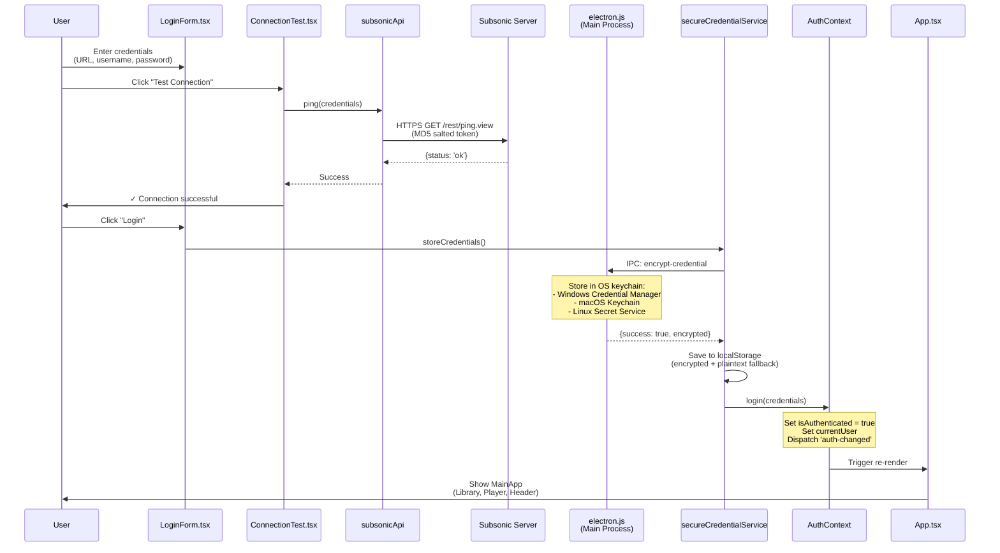

**Scenario 2: Offline Login (No Internet)**

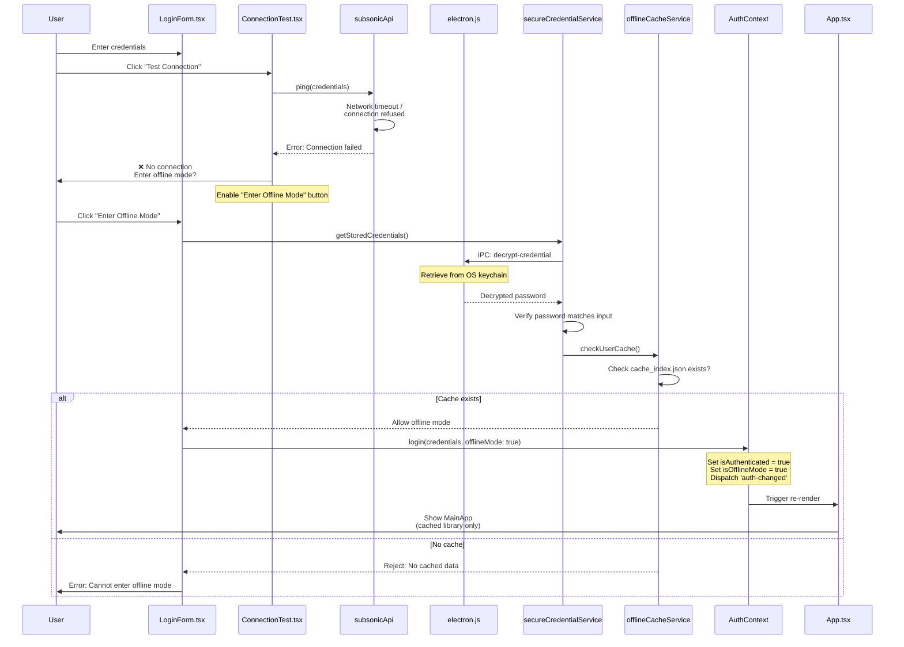

### Token-Based Authentication (Subsonic API)

Every API request uses **salted MD5 tokens** instead of sending passwords directly.

```typescript
// Authentication token generation
function generateAuthParams(username: string, password: string) {
  // 1. Generate random salt (changes every request)
  const salt = Math.random().toString(36).substring(7);
  
  // 2. Create token: MD5(password + salt)
  const token = md5(password + salt);
  
  // 3. Return URL parameters
  return {
    u: username,      // Username in plain text
    t: token,         // MD5 token (not the password!)
    s: salt,          // Salt used for this request
    v: '1.16.1',      // API version
    c: 'Xylonic',     // Client name
    f: 'json'         // Response format
  };
}

// Example API call
const params = generateAuthParams('john', 'password123');
// URL: /rest/ping.view?u=john&t=5f4dcc3b5aa765d61d8327deb882cf99&s=abc123&v=1.16.1&c=Xylonic&f=json
```

**Why This Is Secure:**
- Password never sent in plain text over network
- Salt ensures same password generates different tokens each request
- Even if an attacker intercepts the token, they can't reuse it (different salt next time)
- Server verifies: `MD5(stored_password + received_salt) == received_token`

### HTTPS Enforcement

```typescript
// subsonicApi.ts - Security validation
export const validateServerUrl = (url: string): boolean => {
  const parsedUrl = new URL(url);
  
  // Allow localhost for development
  if (parsedUrl.hostname === 'localhost' || parsedUrl.hostname === '127.0.0.1') {
    return true;
  }
  
  // Require HTTPS for all external connections
  if (parsedUrl.protocol !== 'https:') {
    throw new Error('External servers must use HTTPS');
  }
  
  return true;
};
```

---

## Music Playback Pipeline

### Playback State Machine

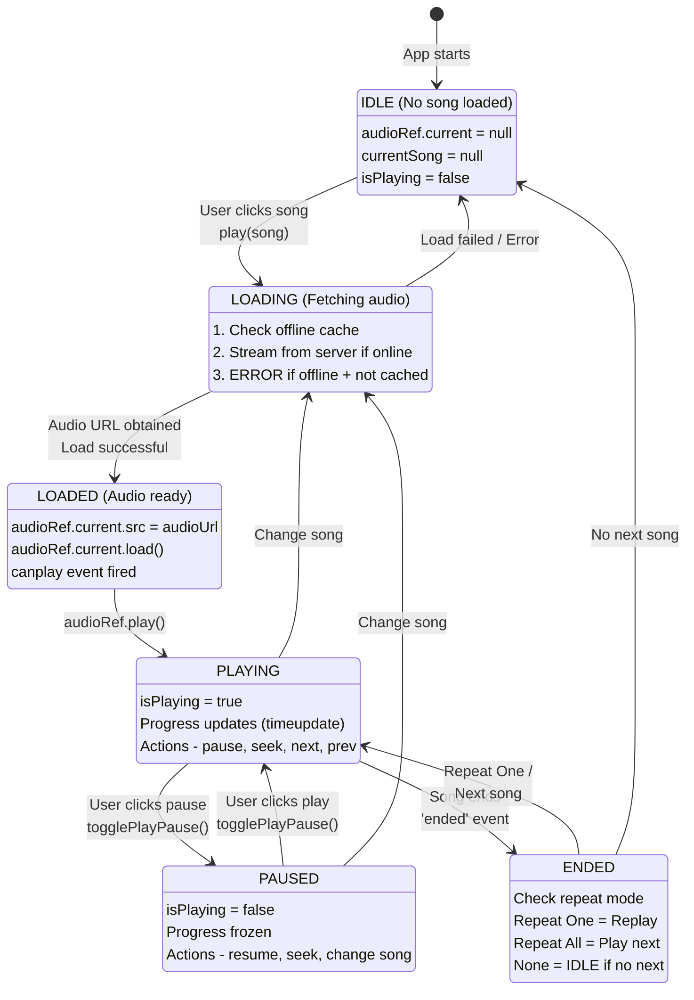

### Audio Source Resolution

```typescript
// PlayerContext.tsx - Audio source selection
const play = async (song: Song) => {
  let audioUrl: string;
  
  // Step 1: Try offline cache first (fastest)
  const cachedAudio = await offlineCacheService.getSongFromCache(song.id);
  
  if (cachedAudio) {
    // Cache hit: Use local file
    audioUrl = URL.createObjectURL(cachedAudio);
    console.log('Playing from cache (instant playback)');
  } else {
    // Cache miss: Check online mode
    if (isOfflineMode) {
      // Offline + not cached = Cannot play
      showError('Song not available offline');
      return;
    }
    
    // Online: Stream from server
    audioUrl = subsonicApi.getStreamUrl(song.id, streamQuality);
    console.log('Streaming from server');
  }
  
  // Step 2: Load audio into HTMLAudioElement
  if (audioRef.current) {
    audioRef.current.src = audioUrl;
    audioRef.current.load();
    
    try {
      await audioRef.current.play();
      setIsPlaying(true);
      setCurrentSong(song);
    } catch (error) {
      console.error('Playback failed:', error);
    }
  }
};
```

### Quality Control & Transcoding

Users can select streaming quality to balance audio fidelity with bandwidth usage.

```typescript
// Bitrate options
const QUALITY_OPTIONS = {
  'original': null,      // No transcoding (server's original file)
  '320': 320000,         // 320 kbps MP3 (high quality)
  '256': 256000,         // 256 kbps MP3
  '192': 192000,         // 192 kbps MP3 (balanced)
  '128': 128000,         // 128 kbps MP3 (lower bandwidth)
  '64': 64000            // 64 kbps MP3 (very low bandwidth)
};

// Stream URL generation with quality parameter
function getStreamUrl(songId: string, quality: string): string {
  const baseUrl = getServerUrl();
  const authParams = generateAuthParams();
  
  let url = `${baseUrl}/rest/stream.view?id=${songId}&${authParams}`;
  
  // Add transcoding parameter if not original
  if (quality !== 'original') {
    url += `&maxBitRate=${QUALITY_OPTIONS[quality]}`;
  }
  
  return url;
}
```

**How It Works:**
- **Original**: Server sends file as-is (no CPU overhead, largest size)
- **320/256/192/128/64 kbps**: Server transcodes on-the-fly to specified bitrate
- **Transcoding**: Server converts high-quality source to lower bitrate for streaming
- **Per-user setting**: Quality preference saved in localStorage

---

## Theme Management

### Theme System Architecture

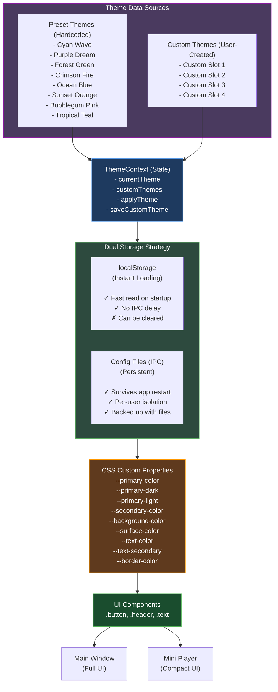

### Theme Loading Flow

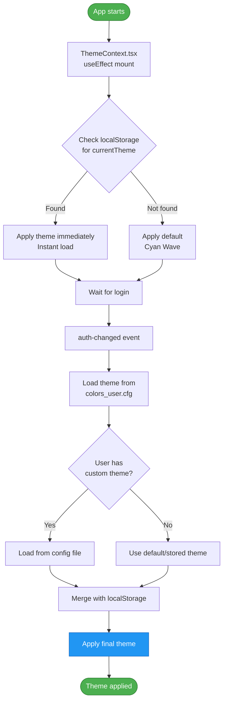

### Custom Theme Editor Flow

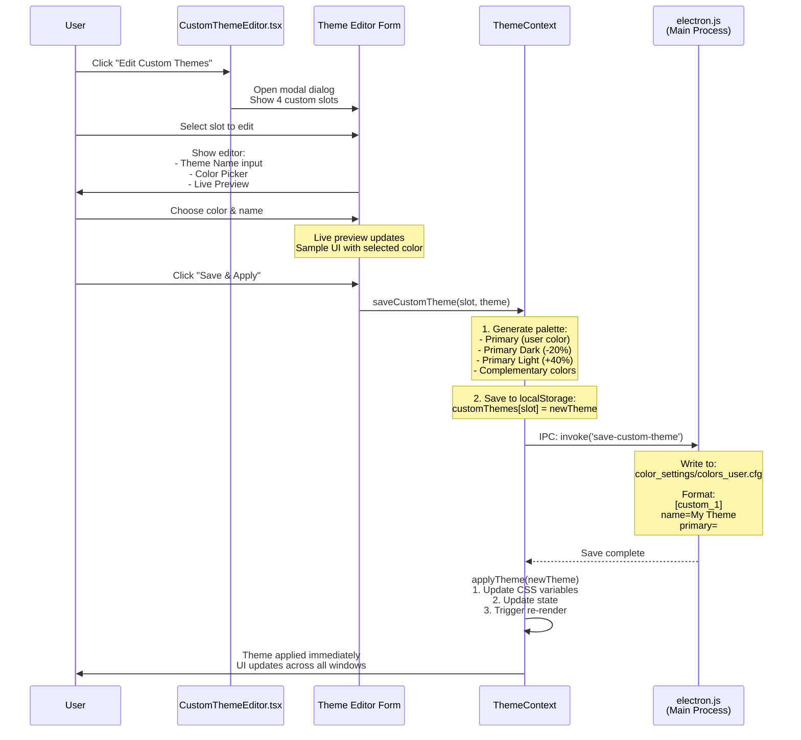

---

## State Management

### Context Architecture

Xylonic uses **React Context API** for global state management. Each context handles a specific domain of application state.

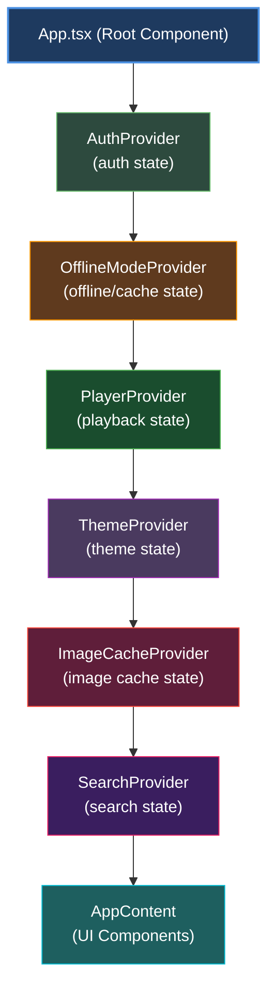

### Context Responsibilities

| Context | State | Actions | Purpose |
|---------|-------|---------|---------|
| **AuthContext** | `isAuthenticated`, `currentUser`, `credentials`, `username`, `serverUrl` | `login()`, `logout()` | Manage user authentication; provides username/serverUrl for cache key generation |
| **PlayerContext** | `currentSong`, `isPlaying`, `trackList`, `volume`, `repeat`, `shuffle` | `play()`, `pause()`, `next()`, `previous()`, `setVolume()` | Control music playback |
| **ThemeContext** | `currentTheme`, `customThemes` | `applyTheme()`, `saveCustomTheme()` | Manage UI themes |
| **OfflineModeContext** | `isOfflineMode`, `cacheStatus`, `downloadQueue` | `toggleOffline()`, `downloadAlbum()`, `clearCache()` | Handle offline features |
| **SearchContext** | `searchQuery`, `searchResults`, `isSearching` | `search()`, `clearSearch()` | Manage search functionality |
| **ImageCacheContext** | `isInitialized` | `getCachedImage()`, `clearCache()`, `getCacheStats()` | Multi-user album art cache with IndexedDB (composite key isolation) |
| **App.tsx (Component)** | `showCachePreload`, `navigation` | `getCacheKey()`, `handleCachePreloadComplete()` | Manages cache preload dialog with user+server specific localStorage keys |

### Cross-Context Communication

Contexts communicate via **custom DOM events** to avoid circular dependencies:

```typescript
// AuthContext.tsx - Logout triggers event
const logout = () => {
  // Clear auth state
  setIsAuthenticated(false);
  setCurrentUser(null);
  
  // Clear secure storage
  secureCredentialService.clearCredentials();
  
  // NOTE: Cache keys (cachePreloaded_user_server) are NOT cleared
  // Each user/server combination maintains independent cache state
  // This prevents clearing other users' cache flags on shared machines
  
  // Notify other contexts
  window.dispatchEvent(new Event('logout'));
  
  // Specific event for theme system
  window.dispatchEvent(new Event('auth-changed'));
};

// PlayerContext.tsx - Listens for logout
useEffect(() => {
  const handleLogout = () => {
    // Stop playback
    if (audioRef.current) {
      audioRef.current.pause();
      audioRef.current.src = '';
    }
    
    // Clear player state
    setCurrentSong(null);
    setTrackList([]);
    setIsPlaying(false);
  };
  
  window.addEventListener('logout', handleLogout);
  return () => window.removeEventListener('logout', handleLogout);
}, []);

// ThemeContext.tsx - Reloads theme on auth change
useEffect(() => {
  const handleAuthChange = () => {
    // Load theme for newly logged-in user
    loadUserTheme();
  };
  
  window.addEventListener('auth-changed', handleAuthChange);
  return () => window.removeEventListener('auth-changed', handleAuthChange);
}, []);

// ImageCacheContext.tsx - Re-initializes cache on auth change (multi-user)
useEffect(() => {
  const handleAuthChanged = () => {
    console.log('[ImageCacheContext] auth-changed event received, re-initializing cache');
    // Re-check credentials and initialize IndexedDB for new user
    // Database connection stays open, just switches user context
    // Memory cache (blob URLs) cleared, IndexedDB data preserved for all users
    initializeCache();
  };
  
  const handleLogout = () => {
    // Only clear state, keep IndexedDB data for future logins
    setIsInitialized(false);
  };
  
  window.addEventListener('auth-changed', handleAuthChanged);
  window.addEventListener('logout', handleLogout);
  return () => {
    window.removeEventListener('auth-changed', handleAuthChanged);
    window.removeEventListener('logout', handleLogout);
  };
}, []);

// Multi-User Cache Behavior:
// ✅ User A logs in  → Initialize cache with userId="userA_server1"
// ✅ User A logs out → State cleared, IndexedDB data preserved
// ✅ User B logs in  → Initialize cache with userId="userB_server2"
//                    → Memory cache cleared (blob URLs)
//                    → Database connection reused
//                    → User A's data still in IndexedDB
// ✅ User A logs back → Instant cache access from IndexedDB
```

---

## Design Patterns & Best Practices

### 1. Service Layer Pattern

Business logic is extracted into **service modules** separate from UI components.

```
Components (UI)  →  Services (Logic)  →  External APIs
     │                    │                    │
   React              Pure TS              Subsonic
   useState           Functions            Server
   useEffect          No state
```

**Example: Authentication**

```typescript
// ❌ BAD: Logic mixed with UI
const LoginForm = () => {
  const [username, setUsername] = useState('');
  const [password, setPassword] = useState('');
  
  const handleLogin = async () => {
    // Direct API call in component (bad!)
    const response = await fetch(serverUrl + '/rest/ping.view?...');
    if (response.ok) {
      localStorage.setItem('auth', JSON.stringify({username, password}));
      setIsAuthenticated(true);
    }
  };
  
  return <form onSubmit={handleLogin}>...</form>;
};

// ✅ GOOD: Logic in service layer
// src/services/authService.ts
export const authenticateUser = async (
  serverUrl: string,
  username: string,
  password: string
): Promise<boolean> => {
  const response = await subsonicApi.ping(serverUrl, username, password);
  return response.status === 'ok';
};

// Component only handles UI
const LoginForm = () => {
  const { login } = useAuth(); // Context handles state
  
  const handleLogin = async () => {
    const success = await authenticateUser(serverUrl, username, password);
    if (success) login({ serverUrl, username, password });
  };
  
  return <form onSubmit={handleLogin}>...</form>;
};
```

### 2. Custom Hooks Pattern

Reusable stateful logic extracted into custom hooks.

```typescript
// src/hooks/usePlayer.ts
export const usePlayer = () => {
  const audioRef = useRef<HTMLAudioElement>(null);
  const [currentSong, setCurrentSong] = useState<Song | null>(null);
  const [isPlaying, setIsPlaying] = useState(false);
  
  const play = async (song: Song) => {
    // Complex playback logic here
    const audioUrl = await resolveAudioSource(song);
    if (audioRef.current) {
      audioRef.current.src = audioUrl;
      await audioRef.current.play();
      setIsPlaying(true);
    }
  };
  
  const pause = () => {
    audioRef.current?.pause();
    setIsPlaying(false);
  };
  
  return { currentSong, isPlaying, play, pause, audioRef };
};

// Components consume the hook
const PlaybackControls = () => {
  const { currentSong, isPlaying, play, pause } = usePlayer();
  
  return (
    <div>
      <button onClick={() => isPlaying ? pause() : play(currentSong)}>
        {isPlaying ? 'Pause' : 'Play'}
      </button>
    </div>
  );
};
```

### 3. Defensive Programming

Extensive null checks and error handling prevent crashes.

```typescript
// ✅ GOOD: Null-safe cache operations
export const getSongFromCache = async (songId: string): Promise<Blob | null> => {
  try {
    // Check if cache directory exists
    if (!cacheIndex) {
      await initializeCache();
    }
    
    // Check if song exists in cache
    const cachedSong = cacheIndex?.songs?.[songId];
    if (!cachedSong) {
      return null; // Not an error, just cache miss
    }
    
    // Check if file actually exists on disk
    const audioPath = cachedSong.audioPath;
    if (!audioPath || !(await fileExists(audioPath))) {
      console.warn(`Cache inconsistency: ${songId} indexed but file missing`);
      return null;
    }
    
    // Read file
    const blob = await readAudioFile(audioPath);
    return blob;
    
  } catch (error) {
    // Log error but don't throw (graceful degradation)
    console.error('Cache read error:', error);
    return null;
  }
};

// Usage: Always handle null case
const audioUrl = await getSongFromCache(song.id);
if (audioUrl) {
  // Use cached version
  playFromCache(audioUrl);
} else {
  // Fall back to streaming
  streamFromServer(song.id);
}
```

### 4. Event-Driven Architecture

Loose coupling between components via DOM events.

```typescript
// Advantages:
// - No direct imports between contexts
// - Easy to add new listeners
// - Prevents circular dependencies

// Emitter
const triggerEvent = (eventName: string, detail?: any) => {
  window.dispatchEvent(new CustomEvent(eventName, { detail }));
};

// Listener
useEffect(() => {
  const handler = (event: CustomEvent) => {
    console.log('Event received:', event.detail);
  };
  
  window.addEventListener('custom-event', handler);
  return () => window.removeEventListener('custom-event', handler);
}, []);
```

### 5. Separation of Main and Renderer

Main process handles system operations, renderer handles UI.

| Operation | Process | Reason |
|-----------|---------|--------|
| Create windows | Main | Requires `BrowserWindow` API |
| File I/O | Main | Security: Renderer has limited FS access |
| OS keychain | Main | Requires native modules |
| UI rendering | Renderer | React runs in browser environment |
| User input | Renderer | DOM events in browser |
| State management | Renderer | React Context API |

### 6. Progressive Enhancement

Features degrade gracefully when unavailable.

```typescript
// Example: Secure credential storage with fallback
export const storeCredentials = async (password: string) => {
  try {
    // Try OS keychain first (best security)
    if (window.electron?.invoke) {
      const result = await window.electron.invoke('encrypt-credential', password);
      if (result.success) {
        return; // Success, exit early
      }
    }
  } catch (error) {
    console.warn('OS keychain unavailable, using fallback');
  }
  
  // Fallback: localStorage (less secure but functional)
  localStorage.setItem('credentials_plaintext', password);
};
```

### 7. User+Server Specific Keys Pattern

For multi-user environments, localStorage keys are namespaced with user and server identifiers to prevent conflicts.

```typescript
// ✅ GOOD: Namespaced keys for multi-user isolation
const getCacheKey = (key: string): string => {
  const user = username || 'unknown';
  const server = serverUrl || 'unknown';
  
  // Hash the server URL to keep key manageable
  const serverHash = Math.abs(
    server.split('').reduce((acc, char) => 
      ((acc << 5) - acc) + char.charCodeAt(0), 0
    )
  );
  
  return `${key}_${user}_${serverHash}`;
};

// Usage examples:
localStorage.setItem(getCacheKey('cachePreloaded'), 'true');
localStorage.setItem(getCacheKey('cachePreloadTimestamp'), Date.now().toString());

// Results in keys like:
// - "cachePreloaded_john_123456789"
// - "cachePreloadTimestamp_john_123456789"
// - "cachePreloaded_jane_987654321" (different user, no conflict)
```

**Benefits:**

- **No Cross-User Interference**: User A's logout doesn't affect User B's cache state
- **Multi-Server Support**: Same user can have different cache states for different servers
- **Shared Machines**: Multiple users on same computer maintain independent preferences
- **Predictable Behavior**: Each user/server combination has consistent, isolated state

**Anti-Pattern to Avoid:**

```typescript
// ❌ BAD: Global keys (causes conflicts)
localStorage.setItem('cachePreloaded', 'true');
// Problem: User B's login would see User A's cache flag

// ❌ BAD: Clearing all cache keys on logout
const logout = () => {
  localStorage.removeItem('cachePreloaded'); // Clears ALL users' flags!
  // Problem: User B loses their cache state when User A logs out
};
```

---

## Performance Optimizations

### 1. Cache-First Playback

Cached songs play instantly without network delay.

**Benchmark:**
- Cached playback: ~50ms (read from disk)
- Streamed playback: ~500-2000ms (network latency)

### 2. Reference-Counted Deduplication

Prevents duplicate audio files across users.

**Storage Savings:**
- 1 album (12 songs, 50MB) downloaded by 3 users:
  - **Without deduplication**: 150MB (50MB × 3)
  - **With deduplication**: 50MB (stored once, referenced 3 times)

### 3. Cover Art Aliasing

All songs in an album reference the same cover art file.

**Storage Savings:**
- 12-song album with 1MB cover art:
  - **Without aliasing**: 12MB (1MB × 12 songs)
  - **With aliasing**: 1MB (stored once, referenced 12 times)

### 4. IndexedDB Image Cache (Multi-User)

Album artwork is cached in browser IndexedDB with **multi-user support**, preventing repeated server requests while isolating each user's data.

**Multi-User Architecture:**
- Uses composite key: `[userId, coverArtId]` for isolation
- User A: `["userA_server1", "ar-123"]`
- User B: `["userB_server2", "ar-123"]`  
- Same album art ID cached for multiple users simultaneously
- **No purging**: All users' cache data coexists peacefully

**User Switching Behavior:**
- Switching users: Database stays open, only updates context
- Memory cache (blob URLs): Cleared to free RAM
- IndexedDB data: **Preserved for all users**
- User returns: Instant cache access (no re-downloading)

**Performance Benefits:**
- First load: Fetch from server (~200-500ms)
- Subsequent loads: IndexedDB cache (~10-20ms)
- Multi-user machine: Each user builds cache once
- Reduces server load and bandwidth usage
- Works offline once cached
- Automatic cleanup of stale images (7-day expiry per user)

### 5. Lazy Loading

Components and data load only when needed.

```typescript
// Don't load all artists on app start
useEffect(() => {
  if (view === 'artists') {
    // Only fetch when user navigates to artists view
    fetchArtists();
  }
}, [view]);
```

---

## Build Process & Cache Management

### Pre-Build Cleanup

**Script:** `scripts/clean-appdata-prebuild.js`

Automatically runs before all build commands to ensure clean builds:

```json
// package.json
{
  "scripts": {
    "prebuild:clean": "node scripts/clean-appdata-prebuild.js",
    "electron:build": "npm run prebuild:clean && npm run build && electron-builder",
    "electron:build:win": "npm run prebuild:clean && npm run build && electron-builder --win",
    // ... all build scripts include prebuild:clean
  }
}
```

**What Gets Cleaned:**

- ✅ Project build artifacts: `build/`, `dist/`
- ✅ AppData/xylonic directory:
  - ❌ **Removed**: `settings.cfg`, `app.log`, temporary files
  - ✅ **Preserved**: `permanent_cache/` (offline songs), `color_settings/` (custom themes)

**Example Output:**

```
╔════════════════════════════════════════╗
║     PRE-BUILD CLEANUP SCRIPT           ║
╚════════════════════════════════════════╝

CLEANING PROJECT BUILD ARTIFACTS
✓ Removed: build/
✓ Removed: dist/

CLEANING APPDATA DIRECTORY
Target directory: C:\Users\..\AppData\Roaming\xylonic

Preserving folders:
  - color_settings
  - permanent_cache

Cleaning...
  ✗ Removed file: settings.cfg
  ✗ Removed file: app.log
  ✓ Preserved: color_settings
  ✓ Preserved: permanent_cache

Removed: 2 item(s)
Preserved: 2 folder(s)
✓ AppData cleanup completed successfully
```

### Runtime Cache Management

**UI Button:** Hamburger Menu → "Clear All Caches"

**Location:** `src/components/common/HamburgerMenu.tsx`

**Functionality:**

```typescript
const handleClearAllCaches = async () => {
  // 1. Confirm with user (shows detailed warning)
  const confirmed = window.confirm(
    '⚠️ Clear All Caches?\n\n' +
    'This will:\n' +
    '• Delete all cached album artwork (IndexedDB)\n' +
    '• Delete all offline cache data (permanent_cache)\n' +
    '• Reset all precache completion flags\n' +
    '• Force complete re-download and re-index on restart\n\n' +
    'Continue?'
  );
  
  if (!confirmed) return;
  
  // 2. Clear offline cache (permanent_cache folder)
  await offlineCacheService.clearAllCache();
  
  // 3. Clear image cache (IndexedDB database)
  await imageCacheService.clearAllCacheAndReset();
  
  // 4. Reload app to trigger CachePreloadDialog
  window.location.reload();
};
```

**What Gets Cleared:**

| Cache Type | Storage Location | Impact |
|------------|------------------|--------|
| **Image Cache** | IndexedDB (`XylonicImageCache`) | All album artwork (all users) |
| **Offline Songs** | `permanent_cache/*.mp3` | All downloaded songs |
| **Precache Flags** | `localStorage.precacheComplete` | Forces CachePreloadDialog on restart |
| **Memory Cache** | Blob URLs (RAM) | All in-memory image references revoked |

**Use Cases:**

- 🔄 **Switching servers**: Clear old server's cached images
- 🗑️ **Reclaim disk space**: Remove large offline cache (GB of data)
- 🔧 **Troubleshooting**: Reset corrupted cache after failed preload
- 📊 **Testing**: Benchmark fresh precache performance

**Safety Features:**

- ⚠️ **Confirmation dialog** with detailed warning
- 🔒 **Preserves color_settings**: Custom themes NOT deleted
- 🔄 **Automatic rebuild**: CachePreloadDialog reopens on reload
- 📝 **Logging**: All operations logged to `app.log`

### Library Pagination

**Components:** `ArtistList.tsx`, `AlbumList.tsx`

**Configuration:**

```typescript
const artistsPerPage = 50;  // Max artists per page
const albumsPerPage = 50;   // Max albums per page
```

**Why Pagination Matters:**

For large libraries (1000+ albums, 300+ artists), rendering all items at once:
- ❌ Creates 1000+ blob URLs simultaneously → Memory exhaustion
- ❌ Causes `ERR_FILE_NOT_FOUND` errors (blob URL limit exceeded)
- ❌ Slow initial render (processing 1000+ DOM nodes)
- ❌ Poor scroll performance (large virtual DOM)

With pagination:
- ✅ Only 50 blob URLs created per page
- ✅ Fast page rendering (<100ms)
- ✅ Smooth navigation between pages
- ✅ Works with libraries of any size

**UI Features:**

```
┌─────────────────────────────────────────┐
│  Artists          Showing 1-50 of 315   │
├─────────────────────────────────────────┤
│  [Artist 1]  [Artist 2]  [Artist 3]     │
│  [Artist 4]  [Artist 5]  [Artist 6]     │
│  ...                                    │
├─────────────────────────────────────────┤
│  < Previous  [1] [2] [3] ... [7]  Next >│
└─────────────────────────────────────────┘
```

- **Page navigation**: Previous/Next buttons + direct page selection
- **Current page indicator**: Active page highlighted
- **Item counter**: "Showing X-Y of Z" header
- **Resets on filter**: Searching/filtering resets to page 1
- **Preserves state**: Page number maintained during navigation

**Implementation:**

```typescript
// State management
const [currentPage, setCurrentPage] = useState(1);
const artistsPerPage = 50;

// Pagination calculation
const totalPages = Math.ceil(filteredArtists.length / artistsPerPage);
const startIndex = (currentPage - 1) * artistsPerPage;
const endIndex = startIndex + artistsPerPage;
const paginatedArtists = filteredArtists.slice(startIndex, endIndex);

// Reset to page 1 when filter changes
useEffect(() => {
  setCurrentPage(1);
}, [filterText]);

// Render only current page
return paginatedArtists.map(artist => (
  <ArtistCard key={artist.id} artist={artist} />
));
```

**CSS Styling:**

```css
/* index.css */
.pagination-controls {
  display: flex;
  justify-content: center;
  align-items: center;
  gap: 10px;
  margin-top: 20px;
}

.pagination-page.active {
  background-color: var(--primary-color);
  color: white;
  font-weight: bold;
}
```

---

## Security Considerations

### 1. Credential Storage

- **Best effort security**: OS-native keychain when available
- **Fallback**: Plaintext localStorage for compatibility
- **Never in code**: No hardcoded passwords or API keys

### 2. HTTPS Enforcement

- All external connections require HTTPS
- Only localhost allowed with HTTP (development)

### 3. Content Security Policy (CSP)

```javascript
// electron.js - Restricts loading external resources
session.defaultSession.webRequest.onHeadersReceived((details, callback) => {
  callback({
    responseHeaders: {
      ...details.responseHeaders,
      'Content-Security-Policy': [
        "default-src 'self'; " +
        "img-src 'self' data: https:; " +
        "media-src 'self' blob: https:; " +
        "style-src 'self' 'unsafe-inline';"
      ]
    }
  });
});
```

### 4. Renderer Sandbox

- Node integration disabled in renderer
- Context isolation enabled
- Preload script as secure IPC bridge

---

## Conclusion

Xylonic's architecture is designed for:

- **Reliability**: Defensive programming, error boundaries, graceful degradation
- **Performance**: Cache-first strategy, deduplication, lazy loading
- **Security**: Encrypted storage, HTTPS enforcement, sandboxed renderer
- **Maintainability**: Service layer, custom hooks, separation of concerns
- **Scalability**: Multi-user support, reference counting, modular design
- **Multi-User Isolation**: User+server specific cache keys prevent conflicts on shared machines

### Key Architectural Innovations

1. **Reference-Counted Cache**: Shared audio storage with per-user metadata prevents duplication
2. **Composite Key Isolation**: IndexedDB and localStorage use `[user, server]` namespacing
3. **Multi-Window IPC**: Bidirectional player state sync across main + mini player
4. **Progressive Cache Building**: Optional first-login cache preload with age-based auto-refresh
5. **Event-Driven Decoupling**: Custom DOM events prevent circular context dependencies
6. **Pagination for Large Libraries**: 50 items per page prevents memory exhaustion from blob URLs
7. **Advanced Cache Management**: One-click clearing of all caches with automatic rebuild

For questions or contributions, refer to the main [README.md](README.md) or open an issue on GitHub.

---

**Last Updated:** February 16, 2026  
**Version:** 26.2.16-release
