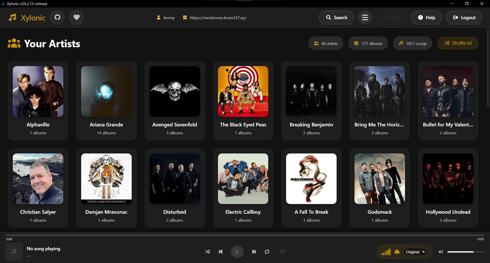
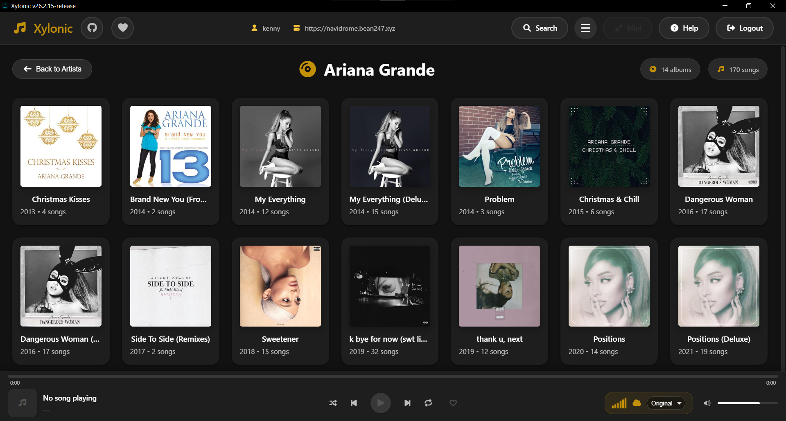
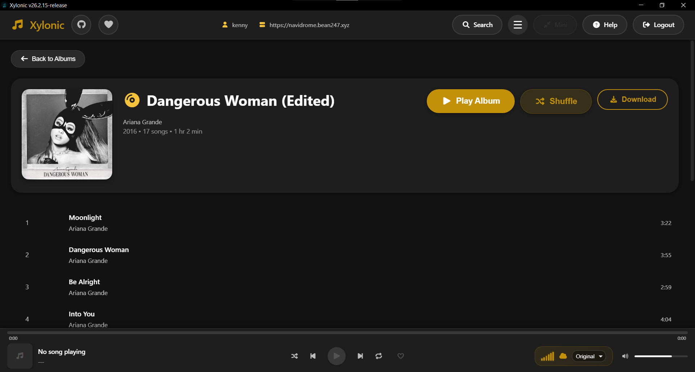
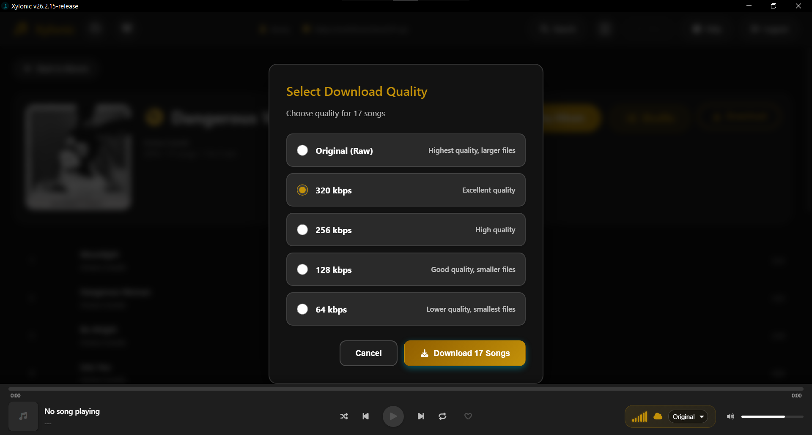
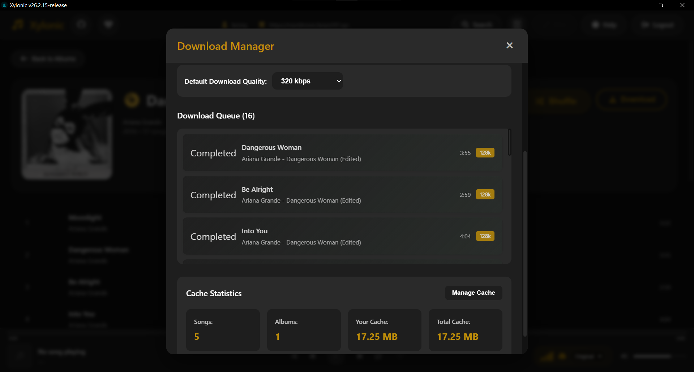
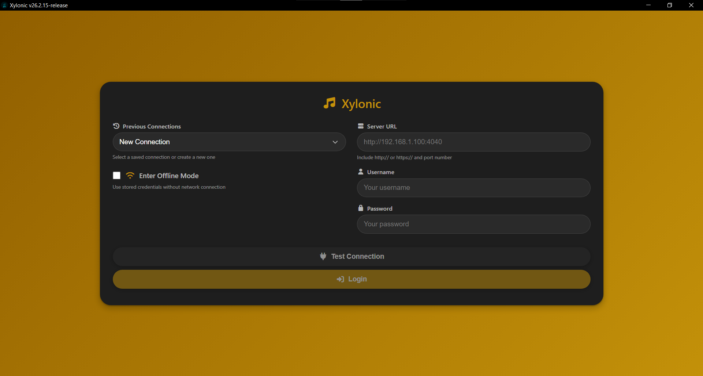

# Xylonic - Subsonic Music Player

A modern, beautiful Electron-based music player for Subsonic-compatible servers with a Spotify-like UI and extensive customization options.

**Version:** 26.2.16-release  
**Author:** BeanGreen247  
**License:** MIT

## Features

### Core Playback
- **Stream Music** - Connect to any Subsonic-compatible server
- **Full Playback Controls** - Play, pause, next, previous with seek
- **Auto-play** - Songs automatically continue to next track
- **Progress Bar** - Visual progress with time display and click-to-seek
- **Volume Control** - Adjustable volume slider with mute

### Theming & Customization
- **12 Total Themes** - 8 preset themes + 4 custom theme slots
- **Preset Themes:**
  - Cyan Wave (default)
  - Purple Dream
  - Forest Green
  - Crimson Fire
  - Ocean Blue
  - Sunset Orange
  - Bubblegum Pink
  - Tropical Teal
- **Custom Theme Editor** - Create your own themes with color picker
- **Live Theme Preview** - See changes in real-time
- **Persistent Storage** - Themes saved locally per user

### Shuffle & Repeat
- **True Random Shuffle** - Starts from random song for authentic shuffle experience
- **Shuffle All** - Shuffle your entire library from Artists page
- **Shuffle Album** - Shuffle individual albums from Album page
- **Repeat Modes** - Off, Repeat All, Repeat One (independent buttons)

### Keyboard Shortcuts
- **Space** - Play/Pause (only when song loaded)
- **Shift + →** - Next Track
- **Shift + ←** - Previous Track
- **→** - Seek Forward 5s
- **←** - Seek Backward 5s
- **Shift + ↑** - Volume Up 10%
- **Shift + ↓** - Volume Down 10%
- **S** - Toggle Shuffle
- **R** - Toggle Repeat
- **M** - Mute/Unmute
- **Ctrl+M** - Toggle Mini Player Mode
- **Ctrl+F** - Focus search bar
- **Escape** - Clear search and return to library

### Library Browser
- **Search** - Real-time search across artists, albums, and songs
- **Artist → Album → Song Hierarchy** - Intuitive navigation
- **Beautiful Album Art** - High-quality cover art throughout
- **Live Stats** - Real-time count of artists, albums, and songs
- **Back Navigation** - Easy navigation up the hierarchy
- **Pagination** - 50 artists/albums per page for large libraries (prevents memory issues)
- **Page Navigation** - Previous/Next buttons and direct page jumps

### User Experience
- **Material You Design** - Modern, clean interface
- **Responsive Layout** - Works on all window sizes
- **No Menu Bar** - Clean, distraction-free interface
- **Mini Player Mode** - Compact always-on-top window for playback control
- **Help Dialog** - Quick reference for keyboard shortcuts
- **Theme Selector Dialog** - Beautiful grid layout for choosing themes
- **Portable** - Runs without installation on Windows and Linux

### Offline Mode & Downloads
- **Permanent Cache** - Download songs to AppData for offline playback
- **Quality Selection** - Choose download quality: Original, 320kbps, 256kbps, 128kbps, or 64kbps
- **Download Manager** - Manage download queue with pause/resume/retry
- **Offline-First Playback** - Cached songs play instantly, fall back to streaming if not cached
- **Album Downloads** - Download entire albums with one click
- **Cache Management** - View cached albums, delete individual albums or clear all cache
- **Connectivity Detection** - Automatic internet check on launch with offline mode prompt
- **Bandwidth Control** - Toggle offline mode while online to conserve bandwidth
- **Storage Efficient** - Cover art aliasing system prevents duplicate downloads (multiple songs reference same image file)

### Streaming Quality Control
- **Bitrate Selection** - Choose streaming quality: Original (no transcoding), 320kbps, 256kbps, 192kbps, 128kbps, or 64kbps
- **Per-User Settings** - Streaming quality preference saved for each user
- **Real-Time Switching** - Change quality anytime from playback controls
- **Bandwidth Management** - Lower bitrates reduce data usage and load times
- **Persistent Settings** - Your quality preference is remembered across sessions

### Security & Privacy
- **Encrypted Credential Storage** - Passwords encrypted at rest using OS-native keychains when available
- **HTTPS Enforcement** - All external server connections require HTTPS (except localhost for development)
- **Offline Mode** - Enter offline mode with stored encrypted credentials without network connection
- **Per-User Storage** - Each user's settings, themes, and cache are isolated
- **Dual Storage** - Plaintext fallback ensures compatibility on systems without secure storage

## Screenshots
Please note, there is a custom color scheme applied, you can have one as well by going to the Hamburger manu and select like shown in image below...

Artists page aka Home...


Artists albums page...


Page for the album itself listing songs and allowing shuffle playback or Downloading of said album to a permanent cache...


Prompting user for the quality in which the want to save the song to permanent cache...


The Download Manager...




Finally the login page...


The Login page has an option to enter offline mode if permanent cache is present and allows the user to prefill connection details if they connected before...

## System Architecture

> **For Developers:** Detailed technical documentation is available in [ARCHITECTURE.md](ARCHITECTURE.md)

Xylonic is built on **Electron 27.3.11** with **React 18.2.0** and **TypeScript 4.9.5**, featuring:

- **Multi-window architecture** - Main window + mini player with synchronized state
- **Context-based state management** - Auth, Player, Theme, Offline, Search contexts
- **IPC communication** - Bidirectional events between main and renderer processes
- **Offline-first caching** - Reference-counted v2.0 cache with deduplication
- **Secure credential storage** - OS-native keychains (Windows Credential Manager, macOS Keychain, Linux Secret Service)
- **Service layer pattern** - Business logic isolated from UI components

### Quick Architecture Overview

```
Main Process (electron.js)           Renderer Process (React)
├─ Window Management                 ├─ Context Providers
├─ IPC Handlers                      ├─ UI Components  
├─ OS Keychain                       ├─ Service Layer
└─ File System I/O                   └─ Subsonic API Client
          │                                    │
          └────── IPC Events ──────────────────┘
```

### Key Features

| Component | Technology | Purpose |
|-----------|-----------|---------|
| **Authentication** | Token-based (MD5 salted) | Secure Subsonic API access |
| **Offline Cache** | Reference-counted files | Multi-user, deduplicated storage |
| **Cover Art** | Aliasing system | One image per album (95% space savings) |
| **Themes** | CSS custom properties | 8 presets + 4 custom slots |
| **Mini Player** | Separate BrowserWindow | Always-on-top compact view |

### Architecture Documentation

For comprehensive technical details, see [ARCHITECTURE.md](ARCHITECTURE.md):
- Multi-process architecture and IPC patterns (with interactive diagrams)
- Offline cache system with reference counting
- Authentication flows (online and offline)
- Music playback pipeline and state machine
- Theme management with dual storage
- Design patterns and best practices
- Performance optimizations and security

> **💡 Tip:** ARCHITECTURE.md uses interactive Mermaid diagrams that render beautifully on GitHub. Click to zoom and explore the system design visually.

## Quick Start

### Prerequisites

- **For Users:** Nothing! Just download and run
- **For Developers:** Node.js 20+ and npm
- **Server:** A Subsonic-compatible server (Navidrome, Airsonic, Gonic, etc.)

### Download & Run (End Users)

#### Windows
1. Download `Xylonic-26.2.16-release-portable.exe` from [Releases](https://github.com/BeanGreen247/xylonic/releases)
2. Double-click to run (no installation needed!)
3. Enter your Subsonic server details and enjoy

#### Linux
1. Download `xylonic-26.2.16-release.tar.gz` from [Releases](https://github.com/BeanGreen247/xylonic/releases)
2. Extract the archive:
   ```bash
   tar -xzf xylonic-26.2.16-release.tar.gz
   ```
3. Navigate to the folder:
   ```bash
   cd xylonic-26.2.16-release
   ```
4. Make the binary executable:
   ```bash
   chmod +x xylonic
   ```
5. Run the app:
   ```bash
   ./xylonic
   ```

**Optional:** Create a desktop shortcut or add to your PATH for easier access.

### Development Setup

```bash
# Clone the repository
git clone https://github.com/BeanGreen247/xylonic.git
cd xylonic

# Install dependencies
npm install

# Start development server
npm run electron:serve
```

## Building from Source

**Important:** Always run `npm run build` first to create the production React build before running any `electron:build` commands.

**Pre-Build Cleanup:** All build commands automatically clean before building:
- **Project directories:** `build/` and `dist/` folders (old build artifacts)
- **AppData directory:** Developer's AppData folder (except `color_settings` and `permanent_cache`)

This ensures a clean build with no stale artifacts. This ONLY happens on your development machine during build - it does NOT affect users.

### Build for Windows (on Windows)
```bash
# Create production build and package (includes automatic pre-build cleanup)
npm run electron:build:win-portable

# Or manually clean first, then build:
npm run prebuild:clean
npm run build
npm run electron:build:win-portable
```
Output: `dist/Xylonic-26.2.16-release-portable.exe`

The build process will:
1. Clean project directories (build/, dist/)
2. Clean your local AppData/xylonic directory (preserves color_settings and permanent_cache)
3. Build the React production bundle
4. Package the Electron app

### Build for Linux (on Linux or WSL2)
```bash
# Create production build and package (includes automatic pre-build cleanup)
npm run electron:build:linux-tar

# Or manually clean first, then build:
npm run prebuild:clean
npm run build
npm run electron:build:linux-tar
```
Output: `dist/xylonic-26.2.16-release.tar.gz`

### Build Both (Windows + Linux tar.gz)
```bash
# Package for both platforms (includes pre-build cleanup)
npm run electron:build:all-portable
```

### Manual Pre-Build Cleanup

If you want to clean your build directories without building:
```bash
npm run prebuild:clean
```

This removes:
- **Project directories:** `build/` and `dist/` (old build artifacts)
- **AppData directory:** Everything from `%APPDATA%\xylonic` except:
  - `color_settings/` - Your custom theme configurations
  - `permanent_cache/` - Your offline music cache

**Note:** AppImage builds require native Linux environment. WSL2 can only build tar.gz archives.

## Clean Build from Scratch

If you encounter build issues or want to ensure a fresh build with no old artifacts:

```bash
# 1. Clean everything (node_modules, build artifacts, caches)
Remove-Item -Recurse -Force node_modules, build, dist -ErrorAction SilentlyContinue

# 2. Install dependencies with legacy peer deps flag
npm install --legacy-peer-deps

# 3. Build production React app
npm run build

# 4. Test the app in development mode
npm run electron:serve

# 5. If everything works, package for distribution
npm run electron:build:win-portable    # Windows
npm run electron:build:linux-tar       # Linux
npm run electron:build:all-portable    # Both platforms
```

### Troubleshooting Build Issues

**Problem:** Blank screen after starting the app  
**Solution:** Delete `build/` folder and run `npm run build` again

**Problem:** Module not found errors  
**Solution:** Delete `node_modules/` and run `npm install --legacy-peer-deps`

**Problem:** Old cached code still running  
**Solution:** Full clean rebuild (see steps above)

**Problem:** Electron won't start  
**Solution:** Check logs in `C:\Users\{YourUsername}\AppData\Roaming\xylonic\app.log`

### Application Logs

Xylonic includes an **optional debug logging feature** for troubleshooting and issue reports:

**Logging Status:** Disabled by default (for privacy and performance)

**To Enable Logging:**
1. Click the hamburger menu (☰) in the top-right corner
2. Click "Debug Logging" to toggle it on
3. The menu will show "Enabled" badge when active
4. Click "Open Log Folder" to view logs in File Explorer

**Log Location:** `C:\Users\{YourUsername}\AppData\Roaming\xylonic\app.log`  
**Log Rotation:** Automatically rotates when file exceeds 5MB (old logs saved as `app.old.log`)  
**Log Contents (when enabled):**
- Application startup and shutdown events
- Authentication attempts and errors
- Cache operations and downloads
- Player state changes and errors
- Network connection issues
- Build and version information

**When to Enable:**
- Experiencing bugs or crashes
- Preparing a bug report/issue
- Troubleshooting connection problems
- Debugging offline mode issues

**Privacy Note:** Logs may contain server URLs and usernames (but NOT passwords). Disable logging when not needed for troubleshooting.

**To view logs:**
- Windows: Use "Open Log Folder" button in menu, or navigate to `%APPDATA%\xylonic`
- Linux: Navigate to `~/.config/xylonic`
- Or check console output when running in development mode with logging enabled

**Note:** AppImage builds require native Linux environment. WSL2 can only build tar.gz archives.

## Usage Guide

### First-Time Setup

1. **Launch Xylonic**
2. **Enter Server Details:**
   - Server URL: `http://your-server:4533` (include `http://` or `https://`)
   - Username: Your Subsonic username
   - Password: Your Subsonic password
3. **Test Connection** - Verify credentials before logging in
4. **Click Login** - Your credentials are saved locally

### Theming

**Access Theme Selector:**
- Click the **Theme** button in the top-right header
- Browse 8 preset themes in a beautiful grid layout
- Select any theme to apply instantly

**Create Custom Themes:**
1. Click **Edit Custom Themes** button in theme selector
2. Choose one of 4 custom theme slots (Custom 1-4)
3. Enter a theme name
4. Pick a color with the color picker or enter hex code
5. Click **Preview** to see changes live
6. Click **Save & Apply** to make it permanent

**Theme Storage:**
- Preset + custom themes are stored locally per OS user and per Subsonic username
- Each user has their own file: `color_settings/colors_{username}.cfg` (Electron userData folder)
- Defaults are created only for a new user; existing files are never overwritten on logout or app restart
- The last selected theme is applied automatically after login

### Keyboard Shortcuts

Press **Help** button in header or refer to shortcuts above. All shortcuts respect song state (won't crash if no song loaded).

### Mini Player Mode

Access a compact always-on-top player window:

**Activate Mini Player:**
- Click the **Mini** button in the header
- Press **Ctrl+M** keyboard shortcut

**Mini Player Features:**
- Album artwork display
- Song title and artist information
- Play, pause, next, previous controls
- Progress bar with time display
- Always stays on top of other windows
- Main window automatically hides

**Return to Main Window:**
- Click the expand icon (↗) in mini player
- Press **Ctrl+M** again
- Close the mini player window

The mini player shares the same playback state with the main window, so you can switch between them without interrupting your music.

### Offline Mode & Downloads

**Downloading Albums for Offline Playback:**

1. **Navigate to an Album** - Click through Artists → Albums → Album View
2. **Click Download Button** - Next to "Play Album" and "Shuffle" buttons
3. **Select Quality** - Choose from:
   - **Original (Raw)** - Highest quality, no transcoding, larger files
   - **320 kbps** - Excellent quality, recommended for most users
   - **256 kbps** - High quality, good balance
   - **128 kbps** - Good quality, smaller files
   - **64 kbps** - Lower quality, smallest files
4. **Confirm Download** - Click "Download X Songs" button
5. **Monitor Progress** - Download Manager opens automatically, or click "Downloads" in header

**Managing Downloads:**

Access the Download Manager from the **Downloads** button in the header:

- **Overall Progress** - See total download progress bar and statistics
- **Pause/Resume** - Pause the entire download queue or resume downloads
- **Retry Failed** - Automatically retry any failed downloads
- **Clear Completed** - Remove completed downloads from queue view
- **Clear Queue** - Cancel all pending downloads

**Offline Mode:**

Toggle offline mode using the **Online/Offline** button in the header:

- **Offline-First** - Cached songs play instantly, streaming used as fallback
- **Bandwidth Saving** - Enable offline mode while online to avoid streaming
- **Connectivity Check** - App detects internet status and prompts for offline mode
- **Online/Offline Indicator** - Green (online) or red (offline) status in header

**Cache Management:**

Multiple ways to manage your cache:

**Download Manager Cache View:**
1. Click **Manage Cache** in Download Manager to view cached albums
2. See total songs, albums, and storage size
3. **Delete Individual Albums** - Click trash icon next to album
4. **Clear Downloaded Songs** - Remove all offline songs from cache

**Hamburger Menu (☰) - Clear All Caches:**
1. Click hamburger menu in top-right corner
2. Select **"Clear All Caches"** button
3. Clears **both** image cache (IndexedDB) and offline songs (permanent_cache)
4. Forces complete rebuild of cache on next startup
5. Use when switching servers or troubleshooting cache issues

**Storage Location:**
- **Windows:** `%APPDATA%\Xylonic\permanent_cache\`
- **Linux:** `~/.config/Xylonic/permanent_cache/`

Cached songs are organized by Artist/Album/Song for easy management.

### Navigation

- **Artists View** - Browse all artists in your library (50 per page)
- **Click Artist** - View all albums by that artist (50 per page)
- **Click Album** - View all songs in that album
- **Click Song** - Start playback
- **Back Buttons** - Navigate back up the hierarchy
- **Page Controls** - Use Previous/Next or click page numbers to navigate

### Playback Controls

| Control | Function |
|---------|----------|
| **Previous** | Go to previous song (or restart if >3s) |
| **Play/Pause** | Toggle playback |
| **Next** | Skip to next song |
| **Shuffle** | Randomize playback order |
| **Shuffle All** | Shuffle entire library (on Artists page) |
| **Shuffle Album** | Shuffle current album (on Album page) |
| **Repeat All** | Loop entire playlist |
| **Repeat One** | Loop current song |

### Features

- **Auto-continue** - Songs automatically play next track
- **True shuffle** - Random first song selection for authentic shuffle experience
- **Progress bar** - Click to seek to any position
- **Volume control** - Adjust or mute with slider
- **Real-time stats** - See your library size in header
- **GitHub link** - Easy access to project repository

## Configuration

### Compatible Servers

Xylonic works with any Subsonic API-compatible server:
- **Navidrome** (Recommended)
- **Airsonic / Airsonic-Advanced**
- **Gonic**
- **Subsonic**
- **Ampache** (with Subsonic API)

### Server URL Format

Always include the protocol and port:
```
YES: http://192.168.1.100:4533
YES: https://music.example.com
YES: http://localhost:4040
NO: 192.168.1.100:4533 (missing protocol)
NO: http://music.example.com/ (trailing slash)
```

### Data Storage

- **Credentials:** Dual storage approach for security and compatibility:
  - Plaintext in localStorage (for backwards compatibility and fallback)
  - Encrypted in OS-native secure storage when available (Windows Credential Manager, macOS Keychain, Linux Secret Service)
- **Settings:** `settings.cfg` in the Electron userData folder
- **Themes:** `color_settings/colors_{username}.cfg` per Subsonic username (no cross-user leakage)
- **Offline Cache:** `permanent_cache/` folder in the Electron userData directory
  - Organized by Artist/Album/Song structure
  - Includes `cache_index.json` for tracking cached songs, metadata, and cover art aliases
  - Cover art aliasing: Multiple songs in same album reference single image file for storage efficiency
- **Electron userData Locations:**
  - **Windows:** `%APPDATA%\Xylonic\`
  - **Linux:** `~/.config/Xylonic/`

## Technology Stack

- **Frontend:** React 18.2.0 + TypeScript 4.9.5
- **Desktop:** Electron 27.3.11
- **Build Tool:** react-scripts 5.0.1
- **HTTP Client:** Axios 1.6.0
- **Styling:** Pure CSS with Material You variables + CSS custom properties for theming
- **State Management:** React Context API (Auth, Player, Theme, Offline, Search)
- **Authentication:** Token-based (MD5 salted, secure credential storage)
- **API:** Subsonic REST API v1.16.1
- **Storage:** localStorage + OS-native secure credential storage (Windows Credential Manager, macOS Keychain, Linux Secret Service)
- **Development Tools:** 
  - Process Management: concurrently 9.2.1
  - Environment Variables: cross-env 10.1.0
  - Build Packaging: electron-builder 24.13.3
  - Type Definitions: @types/react 18.2.0, @types/react-dom 18.2.0, @types/node 20.0.0
  - Utilities: wait-on 9.0.4, electron-is-dev 3.0.1

## Project Structure

```
src/
├── components/          # React components
│   ├── Auth/           # Login and authentication
│   ├── Layout/         # Header and layout components
│   ├── Library/        # Artist, album, song lists
│   ├── Player/         # Playback controls
│   └── common/         # Shared (Theme selector, Keyboard help, Custom theme editor)
├── context/            # React Context providers (Auth, Player, Theme)
├── hooks/              # Custom hooks (useKeyboardShortcuts, usePlayer, etc.)
├── services/           # API and storage services
├── styles/             # Global CSS
├── types/              # TypeScript definitions (Song, Theme, PlayerState)
└── utils/              # Helper functions (logger, md5)
```

## Development

### Running in Development
   
```bash
npm run electron:serve
```

The app will open at `http://localhost:3000`

**Development Mode Behavior:**
- **Auto-logout:** All sessions are automatically cleared when starting in dev mode
- **Debug logging:** All console logs are enabled (disabled in production builds)
- **Fresh state:** You'll need to log in each time you start the dev server

This ensures you're always testing with a clean slate and helps catch authentication issues early.

### Building

```bash
# Production web build (disables all debug logging)
npm run build

# Production Electron build (no auto-logout, no console logs)
npm run electron:build
```

## Development vs Production Behavior

| Feature                | Development                                      | Production                        |
|------------------------|--------------------------------------------------|-----------------------------------|
| Auto-logout on start   | Yes; first dev load clears localStorage once per session (logger) | No auto-clear                     |
| Console logging        | Enabled                                          | Enabled                           |
| Theme persistence      | Per-user `color_settings/colors_{username}.cfg`  | Same                              |
| DevTools               | Opens automatically; Alt+F12 toggle              | Closed by default; Alt+F12 toggle |

Dev start:
```bash
npm run electron:serve
```

Production build:
```bash
npm run build
npm run electron:build
```

**Production vs Development:**

| Feature | Development | Production |
|---------|-------------|------------|
| Console Logs | Enabled | Disabled |
| Auto-logout on start | Yes | No |
| Session persistence | Cleared | Persists |
| Debug info | Verbose | Silent |

### Testing Production Builds

**To verify console logs are disabled in production:**

#### Windows:
```bash
# 1. Build the production version
npm run build
npm run electron:build

# 2. Run the built executable
.\dist\win-unpacked\Xylonic.exe

# 3. Open DevTools (Ctrl+Shift+I or F12)
# 4. Check Console tab - should be empty (no debug logs)
# 5. Test shuffle, playback, navigation - no logs should appear
```

#### Linux:
```bash
# 1. Build the production version
npm run build
npm run electron:build

# 2. Extract and run the built app
cd dist
tar -xzf xylonic-*.tar.gz
cd xylonic-*/
./xylonic

# 3. Open DevTools (Ctrl+Shift+I or F12)
# 4. Check Console tab - should be empty (no debug logs)
# 5. Test shuffle, playback, navigation - no logs should appear
```

**Alternative: Check without DevTools**
```bash
# Windows - Run from command line to see if logs appear in terminal
dist\win-unpacked\Xylonic.exe --no-sandbox

# Linux - Run from terminal
./dist/xylonic-*/xylonic

# If production build is correct: No console output during normal operation
# Only critical errors (if any) would appear
```

## Git Workflow

### Restoring to Stable Version

If you need to restore the working v1.0.0:

```bash
# View all tags
git tag

# Reset to v26.2.16-release (destructive - loses uncommitted changes)
git reset --hard v26.2.16-release

# Or create a recovery branch (safe)
git checkout -b recovery-branch v26.2.16-release

# Or temporarily view v26.2.16-release
git checkout v26.2.16-release
```

### Creating Feature Branches

```bash
# Create and switch to feature branch
git checkout -b feature/my-new-feature

# Make changes and commit
git add .
git commit -m "Add: description of changes"

# Return to main and merge
git checkout main
git merge feature/my-new-feature
```

## Known Issues

None currently! All features working as expected.

**Recent Fixes:**
- Keyboard shortcuts now check if song is loaded before executing
- Theme preferences persist across sessions in production
- Shuffle starts from random song for true shuffle experience
- Development mode auto-logout is intentional for clean testing

## Roadmap

### Completed
- [x] Shuffle functionality (All + Album)
- [x] Keyboard shortcuts with Help dialog
- [x] Theme customization (12 themes total)
- [x] Custom theme editor with color picker
- [x] Theme persistence (localStorage)
- [x] Theme persistence (cfg files)
- [x] Search functionality across library
- [x] Favorites/starred songs
- [x] Mini player mode (always-on-top compact view)
- [x] Offline Mode - Download songs for offline playback with permanent cache
- [x] Quality Control - Select download bitrate (Original, 320, 256, 128, 64 kbps)
- [x] Download Manager - Manage album downloads with queue, pause/resume, and retry
- [x] Connection History - Previous connections saved as dropdown for quick login
- [x] Multi-User Offline Mode - Each user has separate offline cache (enter offline mode as any saved user)
- [x] Quality Control - Select streaming bitrate (Original, 320, 256, 192, 128, 64 kbps)
- [x] Fix offline cache album art and artist art not being stored
- [x] Fix offline cache for liked songs list
- [x] Cover art aliasing - Storage-efficient deduplication system for album art (multiple songs reference same file)
- [x] Logout state management - Clears playback, disables offline mode, resets navigation, preserves username
- [x] Theme-aware cache indicators - Cache badges and quality indicators respect custom theme colors
- [x] Encrypted credential storage - OS-native secure storage for passwords (Windows Credential Manager, macOS Keychain, Linux Secret Service)
- [x] HTTPS enforcement - All external connections require HTTPS for security
- [x] Offline mode login - Enter offline mode with encrypted stored credentials

### Potential Future Features
- [ ] Playlists management (create, edit, save locally)
- [ ] Queue management (view, reorder, clear)
- [ ] Lyrics display (if available from server)
- [ ] Scrobbling support (Last.fm, ListenBrainz)
- [ ] Equalizer with presets
- [ ] Recently played history

## Contributing

Contributions are not welcome! Please leave this project up to me, thx.

## License

MIT License - See LICENSE file for details.

## Support

For issues, questions, or feature requests:
- Open an issue on GitHub
- Check the Subsonic API documentation
- Review existing issues for solutions

## Acknowledgments

- Subsonic API for the music streaming protocol
- React team for the amazing framework
- Electron for cross-platform desktop support
- Material You design system for color inspiration
- All contributors and testers

---

**Built with love for music lovers who want a modern, beautiful, and customizable way to stream their Subsonic library.**

**v26.2.16-release** - Feature-rich release with encrypted credential storage, responsive styling, offline mode types, and cache management utilities