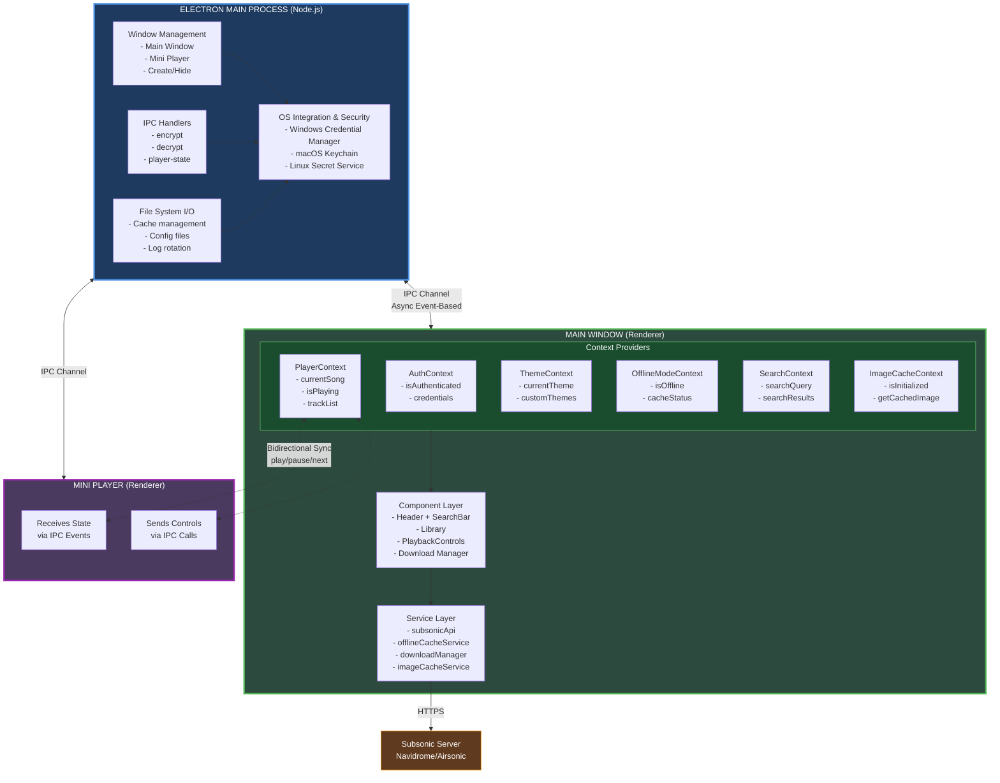

# Overview

Xylonic is an Electron-based desktop music streaming application built with React and TypeScript. It implements a **multi-window architecture** with **bidirectional IPC (Inter-Process Communication)**, **context-based state management**, and a **sophisticated offline caching system** with reference-counted deduplication.

### Core Technologies

| Layer | Technology | Purpose |
|-------|-----------|---------|
| **Desktop Runtime** | Electron 42.x | Native desktop app wrapper |
| **UI Framework** | React 19.2.7 | Component-based user interface |
| **Type Safety** | TypeScript 6.0.3 | Static type checking |
| **State Management** | React Context API | Global state without prop drilling |
| **HTTP Client** | Axios 1.6.0 | API communication with Subsonic servers |
| **Build System** | Vite 8.1.0 | ESM dev server + Rollup/esbuild production builds |
| **Security** | OS-native keychains | Encrypted credential storage |
| **Packaging** | electron-builder 26.x | Cross-platform app bundler |

### Key Features

- **Multi-window support**: Main window + mini player (separate BrowserWindows)
- **Offline-first architecture**: Local cache with reference counting
- **Real-time synchronization**: Player state synced across windows via IPC
- **Secure by design**: Encrypted credentials, HTTPS enforcement
- **Multi-user support**: Per-user settings, themes, and caches with isolated localStorage keys
- **Cache isolation**: User+server specific cache keys prevent conflicts on shared machines
- **Pagination for large libraries**: 50 artists/albums per page prevents blob URL exhaustion
- **Advanced cache management**: One-click clear all caches (images + offline data) with rebuild
- **Build-time cleanup**: Automatic AppData cleanup before builds (preserves permanent_cache and color_settings)
- **Background-safe downloads (Android)**: A `dataSync` foreground service (`DownloadService`) keeps the process alive while the app is backgrounded so JS `fetch()` streams are never interrupted
- **OS-level download notification**: Live notification with song name, X/Y count, speed, and ETA driven by the platform bridge

---

## High-Level Architecture

### Architecture Principles

1. **Separation of Concerns**: Main process handles system operations, renderer handles UI
2. **Unidirectional Data Flow**: State flows down, events flow up
3. **Service Layer Abstraction**: Business logic isolated from UI components
4. **Event-Driven Communication**: IPC events enable loose coupling between processes
5. **Defensive Programming**: Extensive null checks, error boundaries, fallback strategies

---
