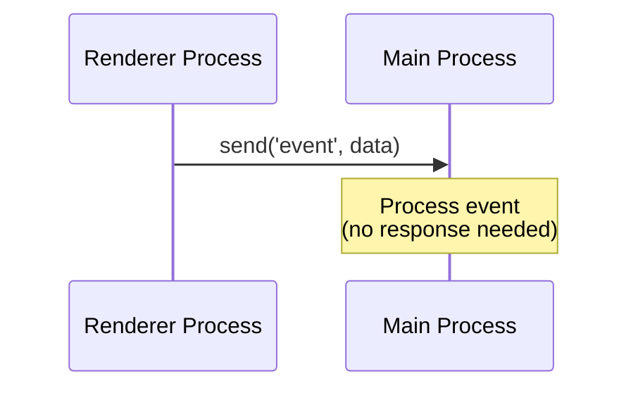
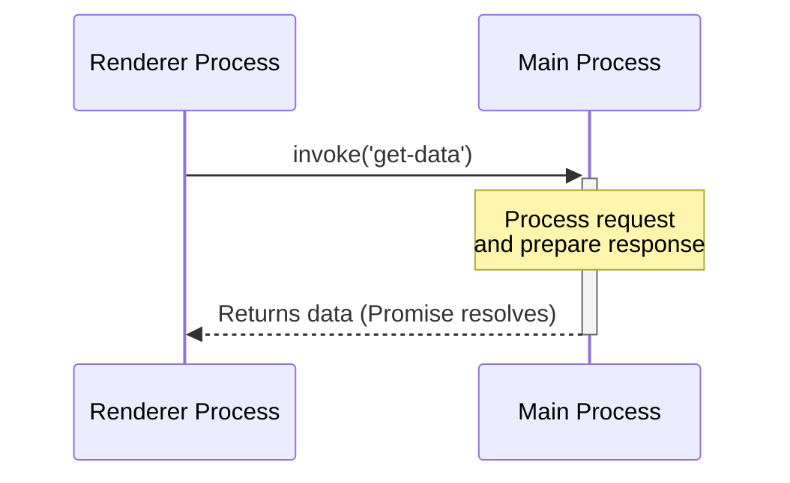
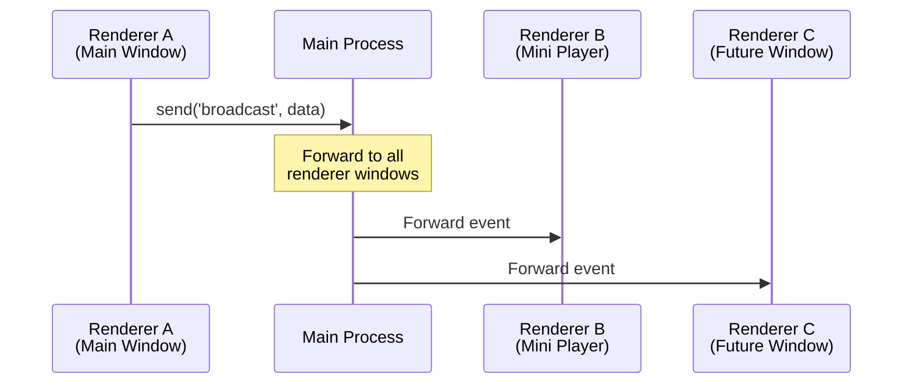
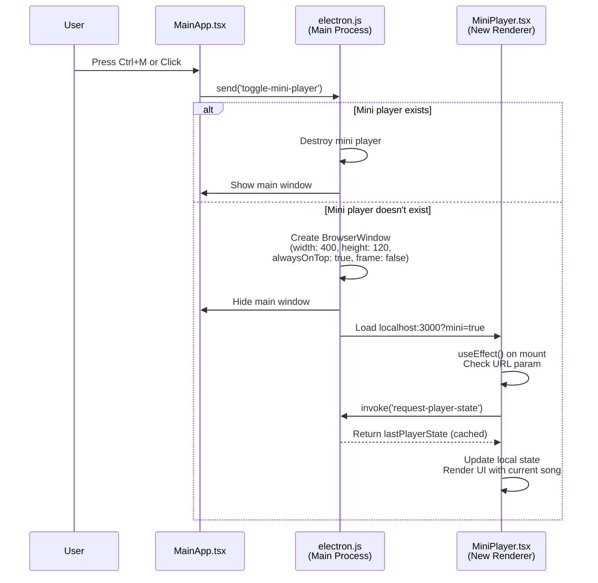
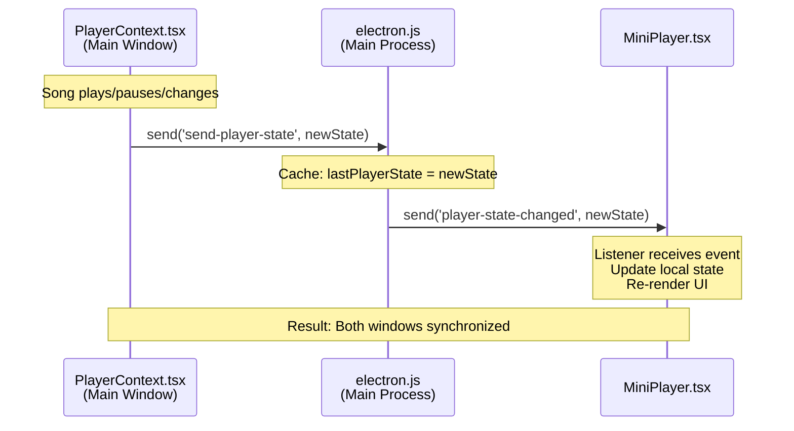
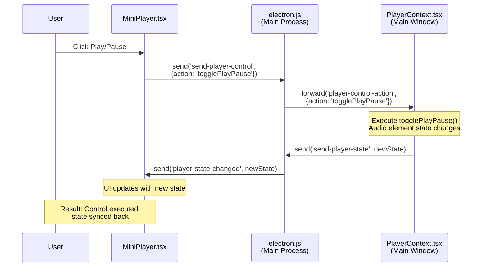

# IPC Communication Patterns

> **Structure note (2026-09):** `public/electron.js` was split from one 2232-line
> file into `public/electron.js` (wiring, 533 lines) + nine
> `public/ipc/<domain>.js` modules (`remote`, `logging`, `settings`,
> `credentials`, `system`, `misc`, `downloadNotification`, `cache`,
> `playerWindow`), each exporting `register<Domain>Ipc(deps)` with shared state
> injected as getters/callbacks. The *handler names and payloads* below are
> unchanged; the *file layout* is not. See
> [ADR 0006](docs/decisions/0006-electron-main-split-into-ipc-modules.md).

### Pattern 1: Fire-and-Forget (One-Way)

Used when the sender doesn't need a response.



**Example: Send player state to mini player**

```typescript
// PlayerContext.tsx (Main Window)
const sendPlayerState = (state: PlayerState) => {
  if (window.electron?.send) {
    window.electron.send('send-player-state', state);
  }
};

// electron.js (Main Process)
ipcMain.on('send-player-state', (event, state) => {
  lastPlayerState = state; // Cache for new windows
  
  if (miniPlayerWindow && !miniPlayerWindow.isDestroyed()) {
    miniPlayerWindow.webContents.send('player-state-changed', state);
  }
});
```

### Pattern 2: Request-Response (Two-Way)

Used when the sender needs data back from the receiver.



**Example: Encrypt credentials**

```typescript
// secureCredentialService.ts (Renderer)
export const storeCredentials = async (
  serverUrl: string,
  username: string,
  password: string
) => {
  try {
    // Request encryption from main process
    const encrypted = await window.electron.invoke('encrypt-credential', {
      serverUrl,
      username,
      password
    });
    
    // Store encrypted result
    localStorage.setItem('credentials_encrypted', JSON.stringify(encrypted));
  } catch (error) {
    console.error('Encryption failed:', error);
  }
};

// electron.js (Main Process)
ipcMain.handle('encrypt-credential', async (event, data) => {
  try {
    // Use OS-native keychain (Windows DPAPI, macOS Keychain)
    const encrypted = await keytar.setPassword(
      'xylonic',
      `${data.serverUrl}::${data.username}`,
      data.password
    );
    return { success: true, encrypted };
  } catch (error) {
    return { success: false, error: error.message };
  }
});
```

### Pattern 3: Event Broadcasting (One-to-Many)

Used to notify multiple windows of state changes.



### Mini Player Synchronization Flow

**Opening Mini Player:**



**Real-Time State Synchronization:**



**User Controls from Mini Player:**



---
