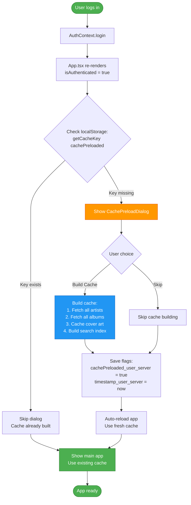
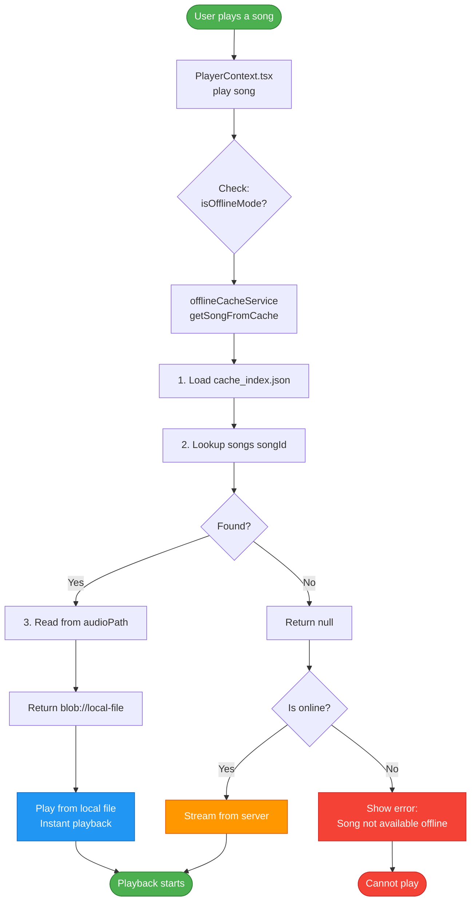

# Offline Cache System

### Cache Architecture v2.1

Xylonic implements a **multi-user, reference-counted cache** to prevent audio file duplication while supporting multiple users on the same machine.

### File System Structure

```
%APPDATA%\xylonic\permanent_cache\
│
├── registry.json                    ← Global reference counter
│   {
│     "a3f5e8b9": {
│       "refCount": 2,              ← 2 users have this file
│       "filename": "song1.mp3",
│       "size": 5242880,
│       "hash": "a3f5e8b9"
│     }
│   }
│
├── users\                           ← Per-user metadata
│   ├── user1@server1\
│   │   ├── cache_index.json        ← User 1's cached songs
│   │   │   {
│   │   │     "songs": {
│   │   │       "song-id-123": {
│   │   │         "id": "123",
│   │   │         "title": "Song Name",
│   │   │         "artist": "Artist Name",
│   │   │         "album": "Album Name",
│   │   │         "audioPath": "audio/a3f5e8b9/song1.mp3",
│   │   │         "audioHash": "a3f5e8b9",
│   │   │         "coverArtPath": "covers/c5d7e8b3.jpg",
│   │   │         "coverArtAlias": "album-id-456",
│   │   │         "quality": "320",
│   │   │         "size": 5242880
│   │   │       }
│   │   │     },
│   │   │     "coverArtAliases": {
│   │   │       "album-id-456": "covers/c5d7e8b3.jpg"
│   │   │     }
│   │   │   }
│   │   │
│   │   └── metadata.json           ← User 1's cache stats
│   │       {
│   │         "totalSongs": 145,
│   │         "totalSize": 756023296,
│   │         "lastUpdated": "2026-02-15T10:30:00Z"
│   │       }
│   │
│   └── user2@server2\               ← User 2's isolated cache
│       ├── cache_index.json
│       └── metadata.json
│
├── audio\                           ← Shared audio storage (deduplicated)
│   ├── a3f5e8b9\
│   │   └── song1.mp3               ← Stored once, referenced by multiple users
│   ├── b4c6d7a2\
│   │   └── song2.mp3
│   └── c5d7e8b3\
│       └── song3.mp3
│
└── covers\                          ← Album artwork (aliased)
    ├── c5d7e8b3.jpg                ← One image for entire album
    ├── d6e8f9c4.jpg
    └── e7f9g0d5.jpg
```

### Reference Counting Algorithm

**Adding a Song (User downloads):**

```typescript
// offlineCacheService.v2.ts
async function addSongToCache(song: Song, audioBlob: Blob, quality: string) {
  // 1. Calculate hash of audio data
  const audioHash = await calculateHash(audioBlob);
  
  // 2. Check if file already exists in shared storage
  const audioPath = `audio/${audioHash}/${song.id}.mp3`;
  const fileExists = await checkFileExists(audioPath);
  
  if (!fileExists) {
    // 3a. New file: Store in shared audio folder
    await saveAudioFile(audioPath, audioBlob);
    
    // 3b. Initialize registry entry
    registry[audioHash] = {
      refCount: 1,
      filename: `${song.id}.mp3`,
      size: audioBlob.size,
      hash: audioHash
    };
  } else {
    // 4. File exists: Increment reference count
    registry[audioHash].refCount += 1;
  }
  
  // 5. Add to user's cache_index.json
  userCache.songs[song.id] = {
    ...song,
    audioPath,
    audioHash,
    quality,
    size: audioBlob.size
  };
  
  // 6. Save updates
  await saveRegistry(registry);
  await saveUserCacheIndex(userCache);
}
```

**Deleting a Song (User removes from cache):**

```typescript
async function removeSongFromCache(songId: string) {
  // 1. Get song metadata from user's cache
  const song = userCache.songs[songId];
  if (!song) return;
  
  // 2. Remove from user's cache_index.json
  delete userCache.songs[songId];
  await saveUserCacheIndex(userCache);
  
  // 3. Decrement reference count in registry
  const audioHash = song.audioHash;
  registry[audioHash].refCount -= 1;
  
  // 4. If no one references this file anymore, delete it
  if (registry[audioHash].refCount === 0) {
    await deleteAudioFile(song.audioPath);
    delete registry[audioHash];
    console.log(`Deleted unused file: ${song.audioPath}`);
  }
  
  // 5. Save updated registry
  await saveRegistry(registry);
}
```

### Cover Art Aliasing

To save space, all songs in an album reference the **same cover art file**.

```typescript
// Cover art aliasing system
coverArtAliases: {
  "album-id-456": "covers/c5d7e8b3.jpg"  // One image for entire album
}

// Song references album ID, not direct path
songs: {
  "song-1": {
    "coverArtAlias": "album-id-456",  // References alias
    "coverArtPath": "covers/c5d7e8b3.jpg"
  },
  "song-2": {
    "coverArtAlias": "album-id-456",  // Same album = same image
    "coverArtPath": "covers/c5d7e8b3.jpg"
  }
}
```

**Benefits:**
- 12-song album = 1 cover art file (not 12 copies)
- Reduces cache size by ~95% for album art
- Faster cache operations (fewer files to manage)

### Cache Preload Dialog System

Xylonic implements a **user+server specific cache preload system** that prompts users to populate their cache on first login, using isolated localStorage keys to prevent cache conflicts between different users and servers.

#### User+Server Specific Keys

Each user/server combination maintains its own cache state flags in localStorage:

```typescript
// Helper function generates unique cache keys
const getCacheKey = (key: string): string => {
  const user = username;           // e.g., "john"
  const server = serverUrl;        // e.g., "https://music.example.com"
  
  // Create hash from server URL to keep key shorter
  const serverHash = server.split('').reduce(
    (acc, char) => ((acc << 5) - acc) + char.charCodeAt(0), 
    0
  );
  
  return `${key}_${user}_${Math.abs(serverHash)}`;
  // Result: "cachePreloaded_john_123456789"
};

// Cache state storage
localStorage.setItem(getCacheKey('cachePreloaded'), 'true');
localStorage.setItem(getCacheKey('cachePreloadTimestamp'), Date.now().toString());
```

#### Multi-User Isolation

**Example Scenario:**

| User | Server | Cache Key | Behavior |
|------|--------|-----------|----------|
| **User A** | `https://server1.com` | `cachePreloaded_userA_12345` | First login → Dialog shows |
| **User A** | `https://server1.com` | `cachePreloaded_userA_12345` | Re-login → Dialog skipped (key exists) |
| **User B** | `https://server2.com` | `cachePreloaded_userB_67890` | First login → Dialog shows (different key) |
| **User A** | `https://server2.com` | `cachePreloaded_userA_67890` | Different server → Dialog shows (new key) |

**Key Benefits:**

- **No Cache Conflicts**: Each user/server maintains independent state
- **Preserved Preferences**: Logout doesn't clear other users' cache flags
- **Multi-Server Support**: Same user on different servers gets prompted separately
- **Shared Hardware**: Multiple users on same machine don't interfere

#### Preload Dialog Flow



#### Cache Age Checking

The system automatically checks cache age on each login and prompts for refresh if stale:

```typescript
// Check cache age (6-day threshold)
const timestampKey = getCacheKey('cachePreloadTimestamp');
const cacheTimestamp = localStorage.getItem(timestampKey);

if (cacheTimestamp) {
  const age = Date.now() - parseInt(cacheTimestamp);
  const SIX_DAYS = 6 * 24 * 60 * 60 * 1000; // 518,400,000 ms
  
  if (age > SIX_DAYS) {
    console.log(`Cache for ${username}@${serverUrl} is stale - triggering refresh`);
    setShowCachePreload(true); // Auto-prompt for rebuild
  }
}
```

**Auto-Refresh Behavior:**

- Cache older than 6 days triggers automatic refresh prompt
- Each user/server combination tracked independently
- Ensures users always have recent album art and search index
- Prevents stale data from accumulating

#### Robust Caching Strategy for Large Libraries

Xylonic's cache preload system is designed to handle **large music libraries** (1000+ albums, 5000+ songs) reliably without overwhelming browsers or servers.

**Browser Connection Limits:**

Browsers limit concurrent HTTP connections per domain (typically 6-8). To respect this:

```typescript
const SAFE_BATCH_SIZE = 6;        // Respects browser connection pool
const RETRY_ATTEMPTS = 3;          // Retry failed requests up to 3 times
const BATCH_DELAY_MS = 100;        // 100ms delay between batches
```

**Retry Logic with Exponential Backoff:**

```typescript
const fetchWithRetry = async (fn: () => Promise<any>, retries = 3): Promise<any> => {
  for (let attempt = 1; attempt <= retries; attempt++) {
    try {
      return await fn();
    } catch (error) {
      if (attempt === retries) throw error;
      
      // Exponential backoff: 500ms → 1s → 2s
      const delay = Math.min(500 * Math.pow(2, attempt - 1), 2000);
      await new Promise(resolve => setTimeout(resolve, delay));
    }
  }
};
```

**Graceful Failure Handling:**

The system uses `Promise.allSettled` instead of `Promise.all` to prevent cascading failures:

```typescript
// ❌ BAD: Promise.all - One failure kills entire batch
await Promise.all(batch.map(item => fetchItem(item)));

// ✅ GOOD: Promise.allSettled - Individual failures logged, batch continues
const results = await Promise.allSettled(batch.map(item => fetchItem(item)));

results.forEach((result, idx) => {
  if (result.status === 'fulfilled') {
    successCount++;
  } else {
    failCount++;
    console.warn(`Failed item ${batch[idx].name}:`, result.reason);
  }
});
```

**Request Timeouts:**

Each fetch includes a 10-second timeout to prevent hanging:

```typescript
const controller = new AbortController();
const timeoutId = setTimeout(() => controller.abort(), 10000);

const response = await fetch(url, { signal: controller.signal });
clearTimeout(timeoutId);
```

**Performance Characteristics (1183 albums, 315 artists):**

| Phase | Items | Batch Size | Est. Time | Memory | Blob URLs Created |
|-------|-------|------------|-----------|--------|-------------------|
| **Artist Images** | 315 | 6 per batch | ~8-12 min | ~50MB | 0 (IndexedDB only) |
| **Album Images** | 1183 | 6 per batch | ~30-40 min | ~150MB | 0 (IndexedDB only) |
| **Search Index** | 5059 songs | 6 albums/batch | ~15-20 min | ~80MB | N/A |
| **Runtime Display** | Max 50 per page | On-demand | Instant | ~2.5MB | Max 100 (LRU cache) |

**Why This Works for Large Libraries:**

1. **No Memory Spikes**: 6-item batches prevent browser RAM exhaustion during preload
2. **Server-Friendly**: 100ms delays prevent overwhelming Subsonic servers
3. **Fault-Tolerant**: Individual failures don't stop the entire process
4. **Progress Tracking**: Real-time UI updates show success/fail counts
5. **Auto-Recovery**: 3-retry strategy handles transient network issues
6. **No Blob URL Exhaustion**: Images cached to IndexedDB without creating 1500+ blob URLs during preload
7. **Pagination**: UI displays 50 items per page, preventing bulk blob URL creation
8. **On-Demand Creation**: Blob URLs created only when images are actually displayed

**Logging Output Example:**

```
[BATCH 1/198] 1.2s | Success: 6, Failed: 0
[BATCH 2/198] 1.1s | Success: 12, Failed: 0
[BATCH 3/198] 1.5s | Success: 17, Failed: 1  ⚠️ Retry succeeded
...
✅ Album covers: 1172 cached, 11 failed (42min 15s total)
```

#### Blob URL Memory Management

**Problem:** Creating blob URLs for 1500+ images exhausts browser memory, causing `ERR_FILE_NOT_FOUND` errors.

**Solution:** Two-tier caching strategy with pagination:

**Phase 1-3: Bulk IndexedDB Caching (No Blob URLs)**

```typescript
// Cache to IndexedDB only during preload (no blob URLs created)
await imageCacheService.cacheImageDirect(coverArtId, url, blob, true); // skipMemoryCache = true
```

**UI Pagination (Prevents Bulk Blob URL Creation)**

```typescript
// ArtistList.tsx & AlbumList.tsx - Display 50 items per page
const artistsPerPage = 50;
const startIndex = (currentPage - 1) * artistsPerPage;
const endIndex = startIndex + artistsPerPage;
const paginatedArtists = filteredArtists.slice(startIndex, endIndex);

// Only 50 images rendered at once, preventing memory exhaustion
return paginatedArtists.map(artist => (
  <ArtistCard key={artist.id} coverArtId={artist.coverArtId} />
));
```

**Runtime: On-Demand Blob URL Creation**

```typescript
async getImage(coverArtId, serverFetchFn) {
  // 1. Check memory cache (max 100 blob URLs)
  if (memoryCache.has(coverArtId)) return memoryCache.get(coverArtId);
  
  // 2. Retrieve from IndexedDB and create blob URL on-demand
  const cached = await getCachedImage(coverArtId);
  if (cached) {
    const blobUrl = URL.createObjectURL(cached.blob); // Created only when needed
    addToMemoryCache(coverArtId, blobUrl); // LRU cache with max 100 items
    return blobUrl;
  }
  
  // 3. Fetch from server as fallback
  return serverFetchFn();
}
```

**Memory Cache Logic (LRU Eviction):**

```typescript
private addToMemoryCache(coverArtId: string, blobUrl: string): void {
  // If cache is full, remove oldest entry
  if (this.memoryCache.size >= 100) {
    const firstKey = this.memoryCache.keys().next().value;
    const oldBlobUrl = this.memoryCache.get(firstKey);
    URL.revokeObjectURL(oldBlobUrl); // Prevent memory leak
    this.memoryCache.delete(firstKey);
  }
  
  this.memoryCache.set(coverArtId, blobUrl);
}

clearMemoryCache(): void {
  // Revoke all blob URLs (called after each warming chunk)
  this.memoryCache.forEach((blobUrl) => {
    URL.revokeObjectURL(blobUrl);
  });
  this.memoryCache.clear();
}
```

**Benefits:**

- **No Bulk Blob URLs**: Preload stores 1500+ images in IndexedDB without creating blob URLs
- **Pagination**: UI displays 50 artists/albums per page, preventing bulk rendering
- **Memory Efficient**: Max 100 blob URLs in memory at any time via LRU cache
- **On-Demand Creation**: Blob URLs created only when images are actually displayed on screen
- **Automatic Cleanup**: LRU eviction + `URL.revokeObjectURL()` prevents memory leaks
- **Fast Rendering**: 100-item memory cache provides instant access to recently viewed images
- **Persistent Storage**: IndexedDB retains images across sessions without blob URL overhead
- **Scalable**: Works with libraries of 1000+ albums without memory issues

**Memory Profile:**

| Phase | Blob URLs Active | RAM Usage | Duration |
|-------|------------------|-----------|----------|
| **Phase 1-3: Bulk Cache** | 0 | ~200MB (IndexedDB writes) | 40-60 min |
| **Page 1 Display (50 artists)** | 50 | ~2.5MB | Instant |
| **Page 2 Display (50 albums)** | 100 (50 new + 50 cached) | ~5MB | Instant |
| **Page 3+ Display** | Max 100 (LRU eviction) | ~5MB | Instant |
| **Runtime (ongoing)** | Max 100 (LRU) | ~5MB | Indefinite |


### Cache Integrity Verification

`offlineCacheService.verifyPermanentCache(onProgress?)` performs a real filesystem check on every song in the user's `CacheIndex` and removes any orphaned index entries.

**Algorithm:**
1. Pre-collect `songIds = Object.keys(cacheIndex.songs)` (snapshot — safe against mutation during iteration)
2. For each song: look up `audioRegistry.audioFiles[song.audioHash]`; call `getBridge().getAudioFilePath(hash, filename)` — on Android this is `Filesystem.stat()` (real FS check); on Electron it delegates to the main process
3. If the file is missing from the registry OR not found on disk: call `removeFromCacheCore(songId)` (decrements ref count, removes from index; safe no-op if audio directory is already absent)
4. Call `onProgress(verified, total)` every 25 songs to avoid UI flooding
5. After the loop: call `saveIndex()` + `saveRegistry()` once (only if `removed > 0`)
6. Return `{ verified, removed, total, durationMs }`

**DownloadManager integration (`downloadManagerService.ts`):**
- `private isVerifying: boolean` guard prevents concurrent runs
- `triggerCacheVerification()` — public; called by the "Verify Cache" button in the UI
- `runCacheVerification()` — private; emits `cache-verify-started`, streams `cache-verify-progress` events every 25 songs, emits `cache-verify-complete` with result
- Auto-triggers at the end of `processQueue()` when the queue drains with at least one completed download

**Event types** (all in `src/types/offline.ts`):
```typescript
'cache-verify-started'
'cache-verify-progress'   // verifyProgress: { verified, total }
'cache-verify-complete'   // verifyResult: { verified, removed, total, durationMs }
```

**UI (DownloadManagerWindow.tsx):** "Cache Integrity" section in Manage Cache shows a "Verify Cache" button (disabled while running or cache is empty), a live `X / Y songs` counter while running, and a result banner displaying verified count, orphaned entries removed, and elapsed time.

---

### Cache Lookup Flow



### IndexedDB Image Cache (Multi-User)

In addition to the audio file cache, Xylonic implements a separate **IndexedDB-based image cache** for album artwork, optimized for multi-user environments.

#### Storage Architecture

```
IndexedDB: XylonicImageCache
│
└── Object Store: images
    ├── Composite Key: [userId, coverArtId]
    │   └── Ensures user isolation without data duplication
    │
    └── Indexes:
        ├── userId (query all images for a user)
        ├── timestamp (find expired images)
        └── coverArtId (lookup across users)
```

#### Data Structure

```typescript
interface CachedImage {
  userId: string;           // "username@serverUrl" (generated hash)
  coverArtId: string;       // Album/artist art ID from server
  url: string;              // Original server URL
  blob: Blob;               // Image binary data
  timestamp: number;        // Cache time (for 7-day expiry)
}

// Storage key: [userId, coverArtId]
// Example entries in same database:
["userA_hash", "ar-123"]  → User A's artist image
["userB_hash", "ar-123"]  → User B's same artist (different server/account)
["userA_hash", "al-456"]  → User A's album image
```

#### Multi-User Behavior

**User A logs in (first time):**
```
1. Initialize imageCacheService with userId="userA_hash"
2. Database opened (or created if first launch)
3. Load images: Query IndexedDB for [userA_hash, *]
4. Cache miss → Fetch from server → Store with [userA_hash, coverArtId]
5. Memory cache (blob URLs) created for fast access
```

**User A logs out:**
```
1. State set to uninitialized
2. Memory cache NOT cleared (for performance on re-login)
3. IndexedDB data preserved
4. Database connection stays open
```

**User B logs in:**
```
1. Initialize imageCacheService with userId="userB_hash"
2. Database already open → Switch context only
3. Memory cache from User A cleared (free RAM)
4. Load images: Query IndexedDB for [userB_hash, *]
5. User A's cache data: Still in IndexedDB, untouched
6. Cache miss for User B → Fetch and store with [userB_hash, coverArtId]
```

**User A logs back in:**
```
1. Initialize imageCacheService with userId="userA_hash"
2. Memory cache cleared (User B's blob URLs)
3. Load images: Query IndexedDB for [userA_hash, *]
4. Cache HIT → Instant load from IndexedDB (no server request)
5. Both User A and User B data coexist in same database
```

#### Key Implementation Details

```typescript
// imageCacheService.ts - User switching logic
async initialize(username: string, serverUrl: string): Promise<void> {
  const newUserId = generateUserId(username, serverUrl);
  
  // Already initialized for this user?
  if (this.db && this.userId === newUserId) {
    return; // No-op, continue using existing cache
  }
  
  // Switching users?
  if (this.db && this.userId && this.userId !== newUserId) {
    // Clear memory cache (blob URLs in RAM) only
    this.memoryCache.forEach(blobUrl => URL.revokeObjectURL(blobUrl));
    this.memoryCache.clear();
    
    // Update context, keep database open
    this.userId = newUserId;
    return; // Switch complete, IndexedDB data preserved
  }
  
  // First initialization: Open database
  this.userId = newUserId;
  this.db = await openIndexedDB();
}

// Composite key ensures isolation
const cachedImage = {
  userId: this.userId,      // Current user context
  coverArtId: 'ar-123',     // Album art ID
  blob: imageBlob,
  timestamp: Date.now()
};

// Store with composite key [userId, coverArtId]
await store.put(cachedImage);
```

#### Benefits

- **Zero Purging**: All users' cache data coexists forever
- **Instant Switching**: Context switch is fast (no re-download)
- **Storage Efficient**: Same image from same server shared if multiple users
- **Privacy**: Each user's data isolated by composite key
- **Performance**: 10-20ms cache hits vs 200-500ms server fetches
- **Offline Support**: Works without network once cached

---
