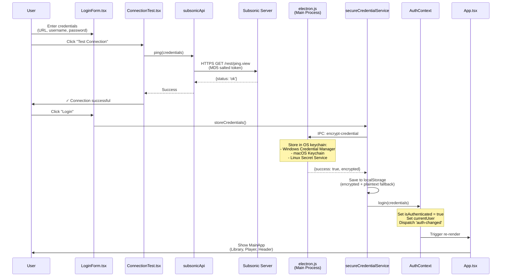
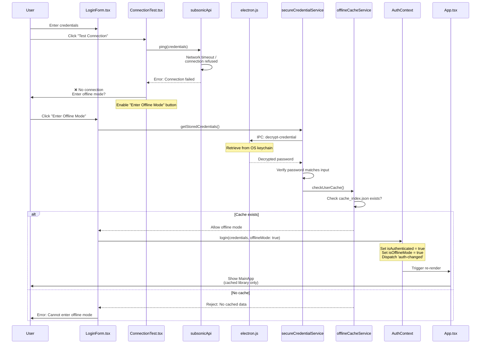

# Authentication & Security

### Authentication Flow Diagram

**Scenario 1: Online Login (First Time)**



**Scenario 2: Offline Login (No Internet)**



### Token-Based Authentication (Subsonic API)

Every API request uses **salted MD5 tokens** instead of sending passwords directly.

```typescript
// Authentication token generation
function generateAuthParams(username: string, password: string) {
  // 1. Generate random salt (changes every request)
  const salt = Math.random().toString(36).substring(7);
  
  // 2. Create token: MD5(password + salt)
  const token = md5(password + salt);
  
  // 3. Return URL parameters
  return {
    u: username,      // Username in plain text
    t: token,         // MD5 token (not the password!)
    s: salt,          // Salt used for this request
    v: '1.16.1',      // API version
    c: 'Xylonic',     // Client name
    f: 'json'         // Response format
  };
}

// Example API call
const params = generateAuthParams('john', 'password123');
// URL: /rest/ping.view?u=john&t=5f4dcc3b5aa765d61d8327deb882cf99&s=abc123&v=1.16.1&c=Xylonic&f=json
```

**Why This Is Secure:**
- Password never sent in plain text over network
- Salt ensures same password generates different tokens each request
- Even if an attacker intercepts the token, they can't reuse it (different salt next time)
- Server verifies: `MD5(stored_password + received_salt) == received_token`

### HTTPS Enforcement

```typescript
// subsonicApi.ts - Security validation
export const validateServerUrl = (url: string): boolean => {
  const parsedUrl = new URL(url);
  
  // Allow localhost for development
  if (parsedUrl.hostname === 'localhost' || parsedUrl.hostname === '127.0.0.1') {
    return true;
  }
  
  // Require HTTPS for all external connections
  if (parsedUrl.protocol !== 'https:') {
    throw new Error('External servers must use HTTPS');
  }
  
  return true;
};
```

---
