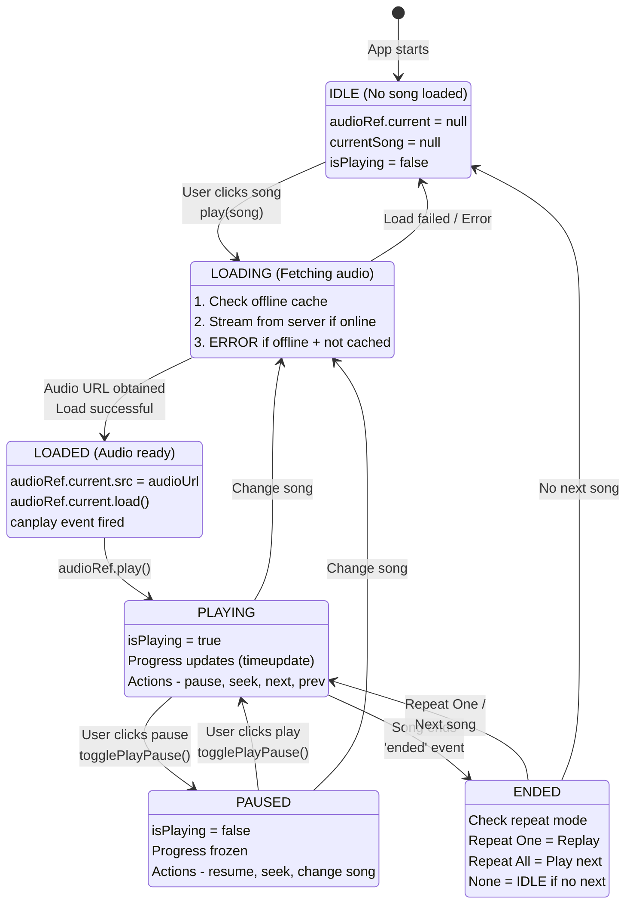

# Music Playback Pipeline

### Playback State Machine



### Audio Source Resolution

```typescript
// PlayerContext.tsx - Audio source selection
const play = async (song: Song) => {
  let audioUrl: string;
  
  // Step 1: Try offline cache first (fastest)
  const cachedAudio = await offlineCacheService.getSongFromCache(song.id);
  
  if (cachedAudio) {
    // Cache hit: Use local file
    audioUrl = URL.createObjectURL(cachedAudio);
    console.log('Playing from cache (instant playback)');
  } else {
    // Cache miss: Check online mode
    if (isOfflineMode) {
      // Offline + not cached = Cannot play
      showError('Song not available offline');
      return;
    }
    
    // Online: Stream from server
    audioUrl = subsonicApi.getStreamUrl(song.id, streamQuality);
    console.log('Streaming from server');
  }
  
  // Step 2: Load audio into HTMLAudioElement
  if (audioRef.current) {
    audioRef.current.src = audioUrl;
    audioRef.current.load();
    
    try {
      await audioRef.current.play();
      setIsPlaying(true);
      setCurrentSong(song);
    } catch (error) {
      console.error('Playback failed:', error);
    }
  }
};
```

### Quality Control & Transcoding

Users can select streaming quality to balance audio fidelity with bandwidth usage.

```typescript
// Bitrate options
const QUALITY_OPTIONS = {
  'original': null,      // No transcoding (server's original file)
  '320': 320000,         // 320 kbps MP3 (high quality)
  '256': 256000,         // 256 kbps MP3
  '192': 192000,         // 192 kbps MP3 (balanced)
  '128': 128000,         // 128 kbps MP3 (lower bandwidth)
  '64': 64000            // 64 kbps MP3 (very low bandwidth)
};

// Stream URL generation with quality parameter
function getStreamUrl(songId: string, quality: string): string {
  const baseUrl = getServerUrl();
  const authParams = generateAuthParams();
  
  let url = `${baseUrl}/rest/stream.view?id=${songId}&${authParams}`;
  
  // Add transcoding parameter if not original
  if (quality !== 'original') {
    url += `&maxBitRate=${QUALITY_OPTIONS[quality]}`;
  }
  
  return url;
}
```

**How It Works:**
- **Original**: Server sends file as-is (no CPU overhead, largest size)
- **320/256/192/128/64 kbps**: Server transcodes on-the-fly to specified bitrate
- **Transcoding**: Server converts high-quality source to lower bitrate for streaming
- **Per-user setting**: Quality preference saved in localStorage

---
