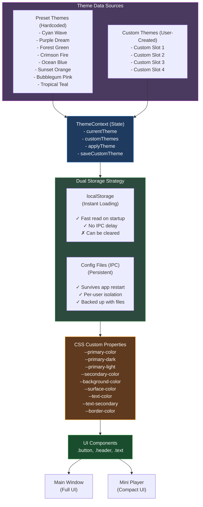
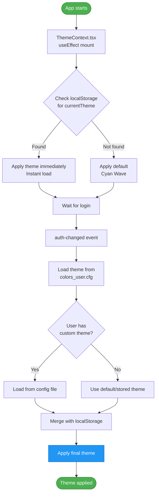
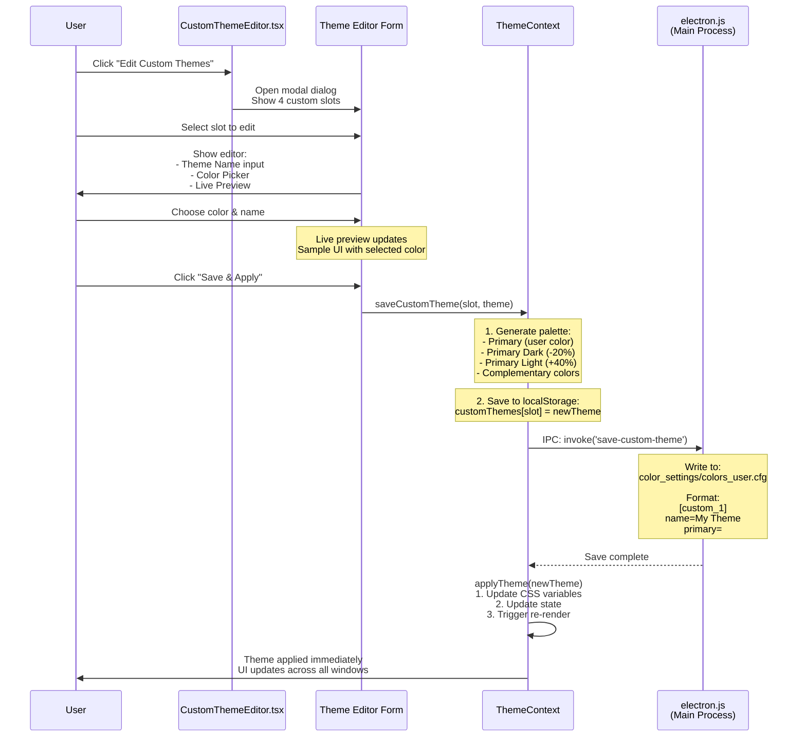

# Theme Management

### Theme System Architecture

```mermaid
graph TD
    subgraph Sources["Theme Data Sources"]
        Presets["Preset Themes (Hardcoded)<br/>- Cyan Wave<br/>- Purple Dream<br/>- Forest Green<br/>- Crimson Fire<br/>- Ocean Blue<br/>- Sunset Orange<br/>- Bubblegum Pink<br/>- Tropical Teal"]
        Custom["Custom Themes (User-Created)<br/>- Custom Slot 1<br/>- Custom Slot 2<br/>- Custom Slot 3<br/>- Custom Slot 4"]
    end
    
    Presets --> ThemeContext
    Custom --> ThemeContext
    
    ThemeContext["ThemeContext (State)<br/>- currentTheme<br/>- customThemes<br/>- applyTheme<br/>- saveCustomTheme"]
    
    ThemeContext --> Storage
    
    subgraph Storage["Dual Storage Strategy"]
        LocalStorage["localStorage<br/>(Instant Loading)<br/><br/>✓ Fast read on startup<br/>✓ No IPC delay<br/>✗ Can be cleared"]
        ConfigFile["Config Files (IPC)<br/>(Persistent)<br/><br/>✓ Survives app restart<br/>✓ Per-user isolation<br/>✓ Backed up with files"]
    end
    
    Storage --> CSS["CSS Custom Properties<br/>--primary-color<br/>--primary-dark<br/>--primary-light<br/>--secondary-color<br/>--background-color<br/>--surface-color<br/>--text-color<br/>--text-secondary<br/>--border-color"]
    
    CSS --> Components["UI Components<br/>.button, .header, .text"]
    
    Components --> MainWin["Main Window<br/>(Full UI)"]
    Components --> MiniWin["Mini Player<br/>(Compact UI)"]
    
    style Sources fill:#4a3a5f,stroke:#9c27b0,color:#fff
    style ThemeContext fill:#1e3a5f,stroke:#4a90e2,color:#fff
    style Storage fill:#2d4a3e,stroke:#66bb6a,color:#fff
    style CSS fill:#5f3a1e,stroke:#ff9800,color:#fff
    style Components fill:#1a4d2e,stroke:#4caf50,color:#fff
```

### Theme Loading Flow

```mermaid
flowchart TD
    Start([App starts]) --> Mount[ThemeContext.tsx<br/>useEffect mount]
    
    Mount --> CheckLocal{Check localStorage<br/>for currentTheme}
    
    CheckLocal -->|Found| ApplyStored[Apply theme immediately<br/>Instant load]
    CheckLocal -->|Not found| ApplyDefault[Apply default<br/>Cyan Wave]
    
    ApplyStored --> WaitAuth[Wait for login]
    ApplyDefault --> WaitAuth
    
    WaitAuth --> AuthEvent[auth-changed event]
    
    AuthEvent --> LoadConfig[Load theme from<br/>colors_user.cfg]
    
    LoadConfig --> HasCustom{User has<br/>custom theme?}
    
    HasCustom -->|Yes| LoadCustom[Load from config file]
    HasCustom -->|No| UseDefault[Use default/stored theme]
    
    LoadCustom --> Merge[Merge with localStorage]
    UseDefault --> Merge
    
    Merge --> ApplyFinal[Apply final theme]
    ApplyFinal --> End([Theme applied])
    
    style Start fill:#4caf50,stroke:#2e7d32,color:#fff
    style ApplyFinal fill:#2196f3,stroke:#1565c0,color:#fff
    style End fill:#4caf50,stroke:#2e7d32,color:#fff
```

### Custom Theme Editor Flow

```mermaid
sequenceDiagram
    participant User
    participant Editor as CustomThemeEditor.tsx
    participant Form as Theme Editor Form
    participant Context as ThemeContext
    participant Main as electron.js<br/>(Main Process)
    
    User->>Editor: Click "Edit Custom Themes"
    Editor->>Form: Open modal dialog<br/>Show 4 custom slots
    
    User->>Form: Select slot to edit
    Form->>User: Show editor:<br/>- Theme Name input<br/>- Color Picker<br/>- Live Preview
    
    User->>Form: Choose color & name
    Note over Form: Live preview updates<br/>Sample UI with selected color
    
    User->>Form: Click "Save & Apply"
    
    Form->>Context: saveCustomTheme(slot, theme)
    
    Note over Context: 1. Generate palette:<br/>- Primary (user color)<br/>- Primary Dark (-20%)<br/>- Primary Light (+40%)<br/>- Complementary colors
    
    Note over Context: 2. Save to localStorage:<br/>customThemes[slot] = newTheme
    
    Context->>Main: IPC: invoke('save-custom-theme')
    
    Note over Main: Write to:<br/>color_settings/colors_user.cfg<br/><br/>Format:<br/>[custom_1]<br/>name=My Theme<br/>primary=#00bcd4<br/>primary_dark=#0097a7
    
    Main-->>Context: Save complete
    
    Context->>Context: applyTheme(newTheme)<br/>1. Update CSS variables<br/>2. Update state<br/>3. Trigger re-render
    
    Context->>User: Theme applied immediately<br/>UI updates across all windows
```

---
