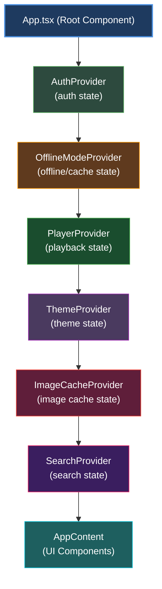

# State Management

### Context Architecture

Xylonic uses **React Context API** for global state management. Each context handles a specific domain of application state.



### Context Responsibilities

| Context | State | Actions | Purpose |
|---------|-------|---------|---------|
| **AuthContext** | `isAuthenticated`, `currentUser`, `credentials`, `username`, `serverUrl` | `login()`, `logout()` | Manage user authentication; provides username/serverUrl for cache key generation |
| **PlayerContext** | `currentSong`, `isPlaying`, `trackList`, `volume`, `repeat`, `shuffle` | `play()`, `pause()`, `next()`, `previous()`, `setVolume()` | Control music playback |
| **ThemeContext** | `currentTheme`, `customThemes` | `applyTheme()`, `saveCustomTheme()` | Manage UI themes |
| **OfflineModeContext** | `isOfflineMode`, `cacheStatus`, `downloadQueue` | `toggleOffline()`, `downloadAlbum()`, `clearCache()` | Handle offline features |
| **SearchContext** | `searchQuery`, `searchResults`, `isSearching` | `search()`, `clearSearch()` | Manage search functionality |
| **ImageCacheContext** | `isInitialized` | `getCachedImage()`, `clearCache()`, `getCacheStats()` | Multi-user album art cache with IndexedDB (composite key isolation) |
| **App.tsx (Component)** | `showCachePreload`, `navigation` | `getCacheKey()`, `handleCachePreloadComplete()` | Manages cache preload dialog with user+server specific localStorage keys |

### Cross-Context Communication

Contexts communicate via **custom DOM events** to avoid circular dependencies:

```typescript
// AuthContext.tsx - Logout triggers event
const logout = () => {
  // Clear auth state
  setIsAuthenticated(false);
  setCurrentUser(null);
  
  // Clear secure storage
  secureCredentialService.clearCredentials();
  
  // NOTE: Cache keys (cachePreloaded_user_server) are NOT cleared
  // Each user/server combination maintains independent cache state
  // This prevents clearing other users' cache flags on shared machines
  
  // Notify other contexts
  window.dispatchEvent(new Event('logout'));
  
  // Specific event for theme system
  window.dispatchEvent(new Event('auth-changed'));
};

// PlayerContext.tsx - Listens for logout
useEffect(() => {
  const handleLogout = () => {
    // Stop playback
    if (audioRef.current) {
      audioRef.current.pause();
      audioRef.current.src = '';
    }
    
    // Clear player state
    setCurrentSong(null);
    setTrackList([]);
    setIsPlaying(false);
  };
  
  window.addEventListener('logout', handleLogout);
  return () => window.removeEventListener('logout', handleLogout);
}, []);

// ThemeContext.tsx - Reloads theme on auth change
useEffect(() => {
  const handleAuthChange = () => {
    // Load theme for newly logged-in user
    loadUserTheme();
  };
  
  window.addEventListener('auth-changed', handleAuthChange);
  return () => window.removeEventListener('auth-changed', handleAuthChange);
}, []);

// ImageCacheContext.tsx - Re-initializes cache on auth change (multi-user)
useEffect(() => {
  const handleAuthChanged = () => {
    console.log('[ImageCacheContext] auth-changed event received, re-initializing cache');
    // Re-check credentials and initialize IndexedDB for new user
    // Database connection stays open, just switches user context
    // Memory cache (blob URLs) cleared, IndexedDB data preserved for all users
    initializeCache();
  };
  
  const handleLogout = () => {
    // Only clear state, keep IndexedDB data for future logins
    setIsInitialized(false);
  };
  
  window.addEventListener('auth-changed', handleAuthChanged);
  window.addEventListener('logout', handleLogout);
  return () => {
    window.removeEventListener('auth-changed', handleAuthChanged);
    window.removeEventListener('logout', handleLogout);
  };
}, []);

// Multi-User Cache Behavior:
// ✅ User A logs in  → Initialize cache with userId="userA_server1"
// ✅ User A logs out → State cleared, IndexedDB data preserved
// ✅ User B logs in  → Initialize cache with userId="userB_server2"
//                    → Memory cache cleared (blob URLs)
//                    → Database connection reused
//                    → User A's data still in IndexedDB
// ✅ User A logs back → Instant cache access from IndexedDB
```

---
